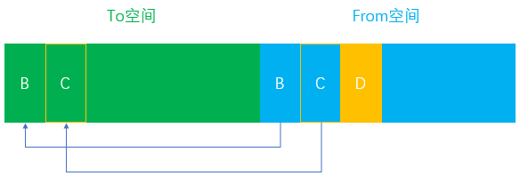
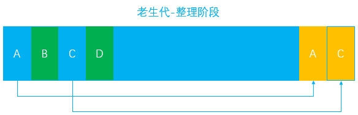
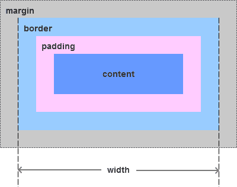

# 前端知识点整理

## JavaScript

### 浅拷贝和深拷贝

```js
function deepObj(obj){
    let newObj = Array.isArray(obj) ? [] : {}
    if (obj && typeof obj === 'object'){
        for (let key in obj){
            if (obj.hasOwnProperty(key)){
                if (key && typeof obj[key] === 'object') newObj[key] = deepObj(obj[key])
                else newObj[key] = obj[key]
            }
        }
    }
    return newObj
}
```


---

### 执行上下文

1. 定义：当前 JavaScript 代码被解析和执行时所在环境的抽象概念， JavaScript 中运行任何的代码都是在执行上下文中运行。

2. 类型：

   - **全局执行上下文**： 这是默认的、最基础的执行上下文。不在任何函数中的代码都位于全局执行上下文中。它做了两件事：
     1. 创建一个全局对象，在浏览器中这个全局对象就是 window 对象。
     2. 将 this 指针指向这个全局对象。一个程序中只能存在一个全局执行上下文。
   - **函数执行上下文**： 每次调用函数时，都会为该函数创建一个新的执行上下文。每个函数都拥有自己的执行上下文，但是只有在函数被调用的时候才会被创建。一个程序中可以存在任意数量的函数执行上下文。

3. 生命周期

   执行上下文的生命周期包括三个阶段：**创建阶段 → 执行阶段 → 回收阶段**

   - 创建阶段

     当函数被调用，但未执行任何其内部代码之前，会做以下三件事：

     * 创建变量对象：首先初始化函数的参数 `arguments`，**提升函数声明**和**变量声明**。
     * 创建作用域链（Scope Chain）：在执行期上下文的创建阶段，作用域链是在变量对象之后创建的。作用域链本身包含变量对象。作用域链用于解析变量。当被要求解析变量时，JavaScript 始终从代码嵌套的最内层开始，如果最内层没有找到变量，就会跳转到上一层父作用域中查找，直到找到该变量。
     * 确定 this 指向：包括多种情况

   - 执行阶段：执行变量赋值、代码执行

    - 回收阶段：执行上下文出栈等待虚拟机回收执行上下文

4. 变量声明和函数声明提升

   ```javascript
   //变量声明提升
   console.log(a); // undefined
   var a = 10;
   
   //函数声明提升
   console.log(f1); // a
   function f1() {
     console.log('a');
   } // 函数声明
   console.log(f2); // undefined
   var f2 = function() {}; // 函数表达式
   ```

   **注意**：当遇到函数和变量同名且都会被提升的情况，**函数声明优先级比较高**，因此变量声明会被函数声明所覆盖，但是可以重新赋值。

   ```javascript
   console.log(a); //输出：function a(){ console.log('我是函数') }
   function a() {
       console.log("我是函数");
   } 
   var a = "我是变量";
   console.log(a); //输出：'我是变量'
   ```

   一个复杂的例子：

   ```javascript
   function test(arg) {
       // 1. 形参 arg 是 "hi"
       // 2. 因为函数声明比变量声明优先级高，所以此时 arg 是 function
       console.log(arg);
       var arg = "hello"; // 3.var arg 变量声明被忽略， arg = 'hello'被执行
       function arg() {
           console.log("hello world");
       }
       console.log(arg);
   }
   test("hi");
   /* 输出：
   function arg(){
       console.log('hello world') 
       }
   hello 
   */
   ```

5. `this`的指向

   - **this 的值是在执行的时候才能确认，定义的时候不能确认**

   

6. 执行上下文栈

   * JavaScript 执行在单线程上，所有的代码都是排队执行。

   * 一开始浏览器执行全局的代码时，首先创建全局的执行上下文，压入执行栈的顶部。

   * 每当进入一个函数的执行就会创建函数的执行上下文，并且把它压入执行栈的顶部。当前函数执行完成后，当前函数的执行上下文出栈，并等待垃圾回收。

   * 浏览器的 JS 执行引擎总是访问栈顶的执行上下文。

   * 全局上下文只有唯一的一个，它在浏览器关闭时出栈。

   * 例子：

     ```javascript
     var color = "blue";
     function changeColor() {
         var anotherColor = "red";
         function swapColors() {
             var tempColor = anotherColor;
             anotherColor = color;
             color = tempColor;
         }
         swapColors();
     }
     changeColor();
     ```

     

     

---

### 原型链


1. 每个函数都有一个 prototype 属性, 函数的 prototype 属性指向了一个对象，这个对象正是调用该构造函数而创建的**实例**的原型，也就是这个例子中的 person1 和 person2 的原型。
   * 什么是原型？每一个JavaScript对象(null除外)在创建的时候就会与之关联另一个对象，这个对象就是我们所说的原型，每一个对象都会从原型"继承"属性。
2. 当读取实例的属性时，如果找不到，就会查找与对象关联的原型中的属性，如果还查不到，就去找原型的原型，一直找到最顶层为止。
3. 当获取 person.constructor 时，其实 person 中并没有 constructor 属性,当不能读取到constructor 属性时，会从 person 的原型也就是 Person.prototype 中读取，正好原型中有该属性。

---

### `call()`&`apply()`

1. 作用：能够**改变函数执行时的上下文**，将一个对象的方法交给另一个对象来执行，并且是立即执行的。

2. 实现

   - `call`

     ```js
     Function.prototype.mycall = function (obj){
         obj = obj || window //obj为null时，是window调用
         obj.fn = this //给对象上添加该方法
         if (arguments.length === 1) obj.fn()//没有多余的参数就直接调用
         else{
             let [o, ...args] = [...arguments]//将第二至最后一个参数赋值给args
             eval('obj.fn(' + args + ')')//执行函数本身
         }
         delete obj.fn//执行完函数之后就删除该方法
     }
     ```

   - `apply`

     ```js
     Function.prototype.myapply = function (obj){
         obj = obj || window
         obj.fn = this
         if (arguments.length === 1) obj.fn()
         else{
           	if (!(arguments[1] instanceof Array)){
                 throw '参数形式应为数组！'
             }
             let args = [...arguments[1]]
             eval('obj.fn(' + args + ')')
         }
         delete obj.fn
     }
     ```

     

3. 用法：

   - `Function.call(obj,[param1[,param2[,…[,paramN]]]])`

     - `call `的第一个参数，是一个对象。 `Function`中的`this`将会指向这个对象。如果不传，则默认为全局对象 `window`

     - 第二个参数开始，可以接收任意个参数。每个参数会映射到相应位置的 `Function` 的参数上。但是如果将所有的参数作为数组传入，它们会作为一个整体映射到 `Function `对应的第一个参数上，之后参数都为空。

       ```javascript
       function func (a,b,c) {}
       
       func.call(obj, 1,2,3)
       // func 接收到的参数实际上是 1,2,3
       
       func.call(obj, [1,2,3])
       // func 接收到的参数实际上是 [1,2,3],undefined,undefined
       ```

   - `Function.apply(obj[,argArray])`

     - 只接收两个参数，第一个参数的规则与 call 一致。

     - 第二个参数，必须是**数组或者类数组**，它们会被转换成类数组，传入` Function `中，并且会被映射到 `Function` 对应的参数上。这也是 call 和 apply 之间，很重要的一个区别。

       ```javascript
       func.apply(obj, [1,2,3])
       // func 接收到的参数实际上是 1,2,3
       
       func.apply(obj, {
           0: 1,
           1: 2,
           2: 3,
           length: 3
       })
       // func 接收到的参数实际上是 1,2,3
       ```

     - 类数组：

       ```javascript
       let arrayLike = {
           0: 1,
           1: 2,
           2: 3,
           length: 3
       };
       ```

       - 类数组 arrayLike 可以通过角标进行调用，具有length属性，同时也可以通过 for 循环进行遍历
       - **类数组无法使用 forEach、splice、push 等数组原型链上的方法**，毕竟它不是真正的数组

4. 用途

   - `call`

     - 对象的继承

       ```javascript
       function superClass () {
           this.a = 1;
           this.print = function () {
               console.log(this.a);
           }
       }
       
       function subClass () {
           superClass.call(this);
           this.print();
       }
       
       subClass();
       // 1
       ```

     - 借用方法（类数组使用数组原型链上的方法）

       ```javascript
       let domNodes = Array.prototype.slice.call(document.getElementsByTagName("*"));
       ```

       

   - `apply`

     - `Math.max()`

     - 数组合并

5. `bind()`

   - `bind()` 方法创建一个新的函数，在调用时设置 `this `关键字为提供的值。并在调用新函数时，将给定参数列表作为原函数的参数序列的前若干项。

     ```javascript
     function add (a, b) {
         return a + b;
     }
     
     function sub (a, b) {
         return a - b;
     }
     
     add.bind(sub, 5, 3); // 这时，并不会返回 8
     add.bind(sub, 5, 3)(); // 调用后，返回 8
     ```

6. 总结

   - call 和 apply 的主要作用，是改变对象的执行上下文，并且是**立即执行**的。它们在**参数**上的写法略有区别。
   - bind 也能改变对象的执行上下文，它与 call 和 apply 不同的是，**返回值是一个函数**，并且需要**稍后再调用**一下，才会执行。

---

### 继承

1. 原型链继承

   ```javascript
   function Parent () {
       this.name = 'kevin';
   }
   
   Parent.prototype.getName = function () {
       console.log(this.name);
   }
   
   function Child () {
   
   }
   
   Child.prototype = new Parent();
   
   var child1 = new Child();
   
   console.log(child1.getName()) // kevin
   ```

   问题：引用类型的属性被所有实例共享

2. 构造函数继承

   ```javascript
   function Parent () {
       this.names = ['kevin', 'daisy'];
   }
   
   function Child () {
       Parent.call(this);
   }
   
   var child1 = new Child();
   
   child1.names.push('yayu');
   
   console.log(child1.names); // ["kevin", "daisy", "yayu"]
   
   var child2 = new Child();
   
   console.log(child2.names); // ["kevin", "daisy"]
   ```

   问题：每次创建实例都会创建一遍方法

3. 组合继承（原型链 + 构造函数继承——**常用**）

   ```javascript
   function Parent (name) {
       this.name = name;
       this.colors = ['red', 'blue', 'green'];
   }
   
   Parent.prototype.getName = function () {
       console.log(this.name)
   }
   
   function Child (name, age) {
       Parent.call(this, name);   
       this.age = age;
   }
   
   Child.prototype = new Parent();//此时 Child.prototype 中的 constructor 被重写了，会导致 child1.constructor === Parent
   Child.prototype.constructor = Child;//将原型对象上的constructor指回自己
   
   var child1 = new Child('kevin', '18');
   
   child1.colors.push('black');
   
   console.log(child1.name); // kevin
   console.log(child1.age); // 18
   console.log(child1.colors); // ["red", "blue", "green", "black"]
   
   var child2 = new Child('daisy', '20');
   
   console.log(child2.name); // daisy
   console.log(child2.age); // 20
   console.log(child2.colors); // ["red", "blue", "green"]
   ```

   - 缺点：

     组合继承最大的缺点是会调用**两次**父构造函数

     一次是设置子类型实例的原型的时候：

     `Child.prototype = new Parent();`

     一次在创建子类型实例的时候：

     `var child1 = new Child('kevin', '18');`

     所以，在这个例子中，如果我们打印 child1 对象，我们会发现 Child.prototype 和 child1 都有一个属性为`colors`，属性值为`['red', 'blue', 'green']`。
     
   - 解决方案：

     使`Child.prototype`间接访问`Parent.prototype`

     ```javascript
     function Parent (name) {
         this.name = name;
         this.colors = ['red', 'blue', 'green'];
     }
     
     Parent.prototype.getName = function () {
         console.log(this.name)
     }
     
     function Child (name, age) {
         Parent.call(this, name);
         this.age = age;
     }
     
     // 关键的三步
     var F = function () {};
     F.prototype = Parent.prototype;
     Child.prototype = new F();
     
     Child.prototype.constructor = Child;
     var child1 = new Child('kevin', '18');
     console.log(child1);
     ```

4. 原型式继承

   ```javascript
   //ES5 Object.create 的模拟实现，将传入的对象作为创建的对象的原型
   function createObj(o) {
       function F(){}
       F.prototype = o;
       return new F();
   }
   
   var person = {
       name: 'kevin',
       friends: ['daisy', 'kelly']
   }
   
   var person1 = createObj(person);
   var person2 = createObj(person);
   
   person1.name = 'person1';
   console.log(person2.name); // kevin
   
   person1.firends.push('taylor');
   console.log(person2.friends); // ["daisy", "kelly", "taylor"]
   ```

   注意：修改`person1.name`的值，`person2.name`的值并未发生改变，并不是因为`person1`和`person2`有独立的 name 值，而是因为`person1.name = 'person1'`，给`person1`**添加了 name 值，并非修改了原型上的 name 值**。

5. 寄生式继承

   ```javascript
   function createObj (o) {
       var clone = Object.create(o);
       clone.sayName = function () {
           console.log('hi');
       }
       return clone;
   }
   ```

   缺点：跟借用构造函数模式一样，每次创建对象都会创建一遍方法

6. 寄生组合式继承（**见上方组合式继承缺点解决方案**）

---

### 作用域

1. **作用域链**：当查找变量的时候，会**先从当前上下文**的变量对象中查找，如果没有找到，就会从**父级**(词法层面上的父级)执行上下文的变量对象中查找，一直找到**全局上下文**的变量对象，也就是全局对象。这样由多个执行上下文的变量对象构成的链表就叫做作用域链。

2. **函数创建**：

   - 函数的作用域在函数定义的时候就决定了

   - `[[scope]]`:当函数创建的时候，就会保存所有父变量对象到其中，可以理解为`[[scope]]` 就是所有父变量对象的层级链，但是注意：`[[scope]] `并不代表完整的作用域链！

   - 举个例子：

     ```javascript
     function foo() {
         function bar() {
             ...
         }
     }
     ```

     函数创建时，各自的`[[scope]]`为：

     ```javascript
     foo.[[scope]] = [
       globalContext.VO
     ];
     
     bar.[[scope]] = [
         fooContext.AO,
         globalContext.VO
     ];
     ```

3. 函数激活

   当函数激活时，进入函数上下文，创建` VO/AO` 后，就会将**活动对象添加到作用域链的前端**。

   这时候执行上下文的作用域链，我们命名为` Scope`：

   ```javascript
   Scope = [AO].concat([[Scope]]);
   ```

   至此，作用域链创建完毕。

4. 执行流程：

   ```js
   var scope = "global scope";
   function checkscope(){
       var scope2 = 'local scope';
       return scope2;
   }
   checkscope();
   ```

   执行过程如下：

   1. checkscope 函数被创建，保存作用域链到内部属性[[scope]]

   ```js
   checkscope.[[scope]] = [
       globalContext.VO
   ];
   ```

   2. 执行 checkscope 函数，创建 checkscope 函数执行上下文，checkscope 函数执行上下文被压入执行上下文栈

   ```js
   ECStack = [
       checkscopeContext,
       globalContext
   ];
   ```

   3. checkscope 函数并不立刻执行，开始做准备工作，第一步：复制函数[[scope]]属性创建作用域链

   ```js
   checkscopeContext = {
       Scope: checkscope.[[scope]],
   }
   ```

   4. 第二步：用 arguments 创建活动对象，随后初始化活动对象，加入形参、函数声明、变量声明

   ```js
   checkscopeContext = {
       AO: {
           arguments: {
               length: 0
           },
           scope2: undefined
       }，
       Scope: checkscope.[[scope]],
   }
   ```

   5. 第三步：将活动对象压入 checkscope 作用域链顶端

   ```js
   checkscopeContext = {
       AO: {
           arguments: {
               length: 0
           },
           scope2: undefined
       },
       Scope: [AO, [[Scope]]]
   }
   ```

   6. 准备工作做完，开始执行函数，随着函数的执行，修改 AO 的属性值

   ```js
   checkscopeContext = {
       AO: {
           arguments: {
               length: 0
           },
           scope2: 'local scope'
       },
       Scope: [AO, [[Scope]]]
   }
   ```

   7. 查找到 scope2 的值，返回后函数执行完毕，函数上下文从执行上下文栈中弹出

   ```js
   ECStack = [
       globalContext
   ];
   ```

---

### 闭包

1. 理论上的闭包：闭包 = 函数 + 函数能够访问的自由变量(面试问的闭包应该不是这个...)

   ```javascript
   var a = 1;
   
   function foo() {
       console.log(a);
   }
   
   foo();
   ```

2. 实践中的闭包：

   - 即使创建它的上下文已经销毁，它仍然存在（比如，内部函数从父函数中返回）
   - 在代码中引用了自由变量

   - 闭包在嵌套函数**定义**的时候就产生了
   - 闭包在包含闭包的函数对象成为**垃圾对象**的时候死亡

3. 分析：

   ```javascript
   var scope = "global scope";
   function checkscope(){
       var scope = "local scope";
       function f(){
           return scope;
       }
       return f;
   }
   
   var foo = checkscope();
   foo();
   ```

   - 执行流程：
     - 进入全局代码，创建全局执行上下文，全局执行上下文压入执行上下文栈
     - 全局执行上下文初始化
     - 执行 checkscope 函数，创建 checkscope 函数执行上下文，checkscope 执行上下文被压入执行上下文栈
     - checkscope 执行上下文初始化，创建变量对象、作用域链、this等
     - checkscope 函数执行完毕，checkscope 执行上下文从执行上下文栈中弹出
     - 执行 f 函数，创建 f 函数执行上下文，f 执行上下文被压入执行上下文栈
     - f 执行上下文初始化，创建变量对象、作用域链、this等
     - f 函数执行完毕，f 函数上下文从执行上下文栈中弹出

4. 面试题

   1. ```javascript
      var data = [];
      
      for (var i = 0; i < 3; i++) {
        data[i] = function () {
          console.log(i);
        };
      }
      
      data[0]();
      data[1]();
      data[2]();
      ```

      - 全都是“3”，因为执行`data[0]()`函数时，全局的`i`已经是3了

      ```javascript
      var data = [];
      
      for (var i = 0; i < 3; i++) {
        data[i] = (function (i) {
              return function(){
                  console.log(i);
              }
        })(i);
      }
      
      data[0]();
      data[1]();
      data[2]();
      ```

      - 0, 1, 2——因为匿名函数的Context.AO(上下文活动对象)保存在`data[0]()`的作用域链上。

   2. ```javascript
      function fun(n,o) {
        console.log(o)
        return {
          fun:function(m){
            return fun(m,n);
          }
        };
      }
      var a = fun(0);  a.fun(1);  a.fun(2);  a.fun(3);//undefined,0,0,0
      var b = fun(0).fun(1).fun(2).fun(3);//undefined,0,1,2
      var c = fun(0).fun(1);  c.fun(2);  c.fun(3);//undefined,0,1,1
      ```

      - 根据代码可知闭包里面只有`n`；
      - 只要调用`fun()`，都会返回一个对象，对象中的`fun(m)`方法实际调用的是外部的`fun(n, o)`，其中`m`对应`n`，旧的`n`对应新的`o`；
      - 所以将返回的对象赋值后变量`n`就变成了传入的`m`；
      - 但是如果不在返回的新对象中调用`fun()`函数的话，变量`n`就不会改变，比如第9行的`a.fun()`，不管传入什么值，只会执行`fun(m, 0)`。

5. 缺点&解决方法

   - 缺点
     - 函数执行完成之后局部变量没有释放，导致内存被占用时间变长
     - 容易造成内存泄漏
   - 解决方法
     - 尽量避免使用闭包
     - 及时释放包含闭包的函数对象

---

### 变量提升&函数提升

1. 变量提升

     ```js
        console.log(a);  //undefined
         var a = 123;
     ```

     因为变量a的声明被提到了作用域顶端。上面代码编译后应该是下面这个样子

     ```js
         var a;
         console.log(a)
         a = 123
         //所以输出内容为 undeifend
     ```

2. 函数提升

   ```js
   //函数声明式
   bar()//输出1
   function bar () {
     console.log(1);
   }
   //变量形式声明； 
   foo()//报错：TypeError: foo is not a function
   var foo = function () {
     console.log(1);
   }
   ```

   - 函数变量形式声明和**普通变量提升**一样，只是一个没有值的变量，如果在之前使用会**报错**。

   - 函数声明式的提升现象和变量提升略有不同，函数声明式会提升到作用域最前边，并且将声明内容一起提升到最上边。

3. 总结：

   - 所有的声明都会提升到作用域的最顶上去。

   - 同一个变量只会声明一次，其他的会被忽略掉或者覆盖掉。

   - **函数声明的优先级高于变量声明的优先级**，并且函数声明和函数定义的部分一起被提升。

     ```js
     a()//输出function
     function a(){
         console.log('function')
     }
     var a = 1;
     ```

---

### `this`的指向

1. `this`的指向在函数定义的时候是确定不了的，只有函数执行的时候才能确定`this`到底指向谁**，**实际上`this`的最终指向的是那个调用它的对象。

2. 如果一个函数中有`this`，但是它没有被上一级的对象所调用，那么`this`指向的就是`window`，这里需要说明的是在js的严格模式下中`this`指向的不是`window`。

3. 如果一个函数中有`this`，这个函数有被上一级的对象所调用，那么`this`指向的就是上一级的对象。

4. 如果一个函数中有`this`，**这个函数中包含多个对象，尽管这个函数是被最外层的对象所调用，`this`指向的也只是它上一级的对象**。

   ```js
   var o = {
       a:10,
       b:{
           // a:12,
           fn:function(){
               console.log(this.a); //undefined
           }
       }
   }
   o.b.fn();
   ```

   ```js
   var o = {
       a:10,
       b:{
           a:12,
           fn:function(){
               console.log(this.a); //undefined
               console.log(this); //window
           }
       }
   }
   var j = o.b.fn;
   j();
   ```

5. `new`、`call`、`apply`、`bind`可以改变`this`的指向。

6. `this`和`return`

   - 如果返回值是一个对象，那么**this指向的就是那个返回的对象**，如果返回值不是一个对象那么this还是指向**函数的实例**。(`null`除外)

   ```js
   function fn()  
   {  
       this.user = 'user';  
       return {};  
   }
   var a = new fn();  
   console.log(a.user); //undefined
   ```

   ```js
   function fn()  
   {  
       this.user = 'user';  
       return undefined;
   }
   var a = new fn();  
   console.log(a.user); //user
   ```

   ```js
   function fn()  
   {  
       this.user = 'user';  
       return null;
   }
   var a = new fn();  
   console.log(a.user); //user
   ```

---

### 立即执行函数

1. 函数声明式和函数表达式

    - 函数声明式：`function f(){}`

    - 函数表达式：`var f = function(){}`

    - 区别：

      - 函数声明的函数名必须写，函数表达式不一定要写；

      - 函数声明式的整个函数会进行函数提升，而函数表达式只是定义的`f`变量提升；

      - 函数声明式不是一个完整的语句，不能出现在if-else, for循环等语句中；

      - 如果函数表达式声明的函数有函数名,那么这个函数名就相当于这个函数的一个**局部变量**,只能在函数内部调用,举个栗子:

        ```js
        var f = function fact(x) { 
        	if (x <= 1) 
        	     return 1;
        	 else 
        	     return x*fact(x-1);
        	 };
         alert(fact(10));   // Uncaught ReferenceError: fact is not defined
        ```

        

2. 写法（**括号前面不能是函数声明式**）

    - 错误写法1️⃣

      ```js
      function(){ /* code */}(); //SyntaxError: Unexpected token
      ```

    当圆括号为了调用函数而出现在函数后面时，无论在全局环境或者局部环境里遇到了这样的`function`关键字，默认的，它会将它当作是一个**函数声明**，而不是函数表达式，如果你不明确的告诉圆括号它是一个表达式，它会将其当作没有名字的函数声明并且抛出一个错误，因为函数声明需要一个名字。

    - 错误写法2️⃣

      ```js
      //函数声明语法上是无效的，它仍然是一个声明，圆括号里需要包含表达式
      function foo(){ /* code */ }();//SyntaxError: Unexpected token
      
      //现在把一个表达式放在圆括号里，没有抛出错误...,但是函数也并没有执行，因为：
      function foo(){/* code */}(1)
      
      //它等同于一个函数声明跟着一个完全没有关系的表达式:
      function foo(){/* code */}
      (1);
      ```

    - 正确写法

      ```js
      (function(){/* code */}());//括号内的表达式代表函数立即调用表达式
      (function(){/* code */})();//括号内的表达式代表函数表达式
      ```

      将函数声明包裹在圆括号里来告诉语法分析器去表达一个函数表达式，因为在Javascript里，圆括号不能包含声明。因为这点，当圆括号为了包裹函数碰上了 `function`关键词，它便知道将它作为一个函数表达式去解析而不是函数声明。注意理解这里的圆括号和上面的圆括号遇到函数时的表现是不一样的，也就是说。

      * 当圆括号**出现在匿名函数的末尾**想要调用函数时，它会默认将函数当成是函数声明。
      * 当圆括号**包裹函数**时，它会默认将函数作为表达式去解析，而不是函数声明。

3. 保存闭包状态（见闭包面试题第2️⃣题）

    - 当函数通过他们的名字被调用时，参数会被传递；而当函数表达式被立即调用时，参数也会被传递。一个立即调用的函数表达式可以用来锁定值并且有效的保存此时的状态，因为任何定义在一个函数内的函数都可以使用外面函数传递进来的参数和变量(这种关系被叫做闭包)。

---

### `instanceof`&`typeof`

1. `typeof` 一般被用于判断一个变量的类型，我们可以利用 `typeof` 来判断`number`, `string`, `object`, `boolean`, `function`, `undefined`, `symbol` 这七种类型。

2. `Symbol`

   - `symbol`不会被`Object.keys()`和`for...in`枚举，所以可以用来定义不需要对外操作和访问的属性
   - 对象转换成`JSON`字符串时也会被排除在外
   - 可以用`Symbol`来替代常量

3. `typeof`原理：

   - js 在底层存储变量的时候，会在变量的机器码的低位1-3位存储其类型信息
     - 000：对象
     - 010：浮点数
     - 100：字符串
     - 110：布尔
     - 1：整数
   - `null`储存方式是所有机器码全为0
   - `undefined`的储存方式是-2<sup>30</sup>整数表示
   - 所以，`typeof` 在判断 `null` 的时候就出现问题了，由于 `null` 的所有机器码均为0，因此直接被当做了对象来看待。

4. `instanceof`原理

   - `instanceof` 主要的作用就是判断一个实例是否属于某种类型或者判断一个实例是否是其父类型或者祖先类型的实例。

     ```js
     //第一种
     let person = function () {
     }
     let nicole = new person()
     nicole instanceof person // true
     
     //第二种
     let person = function () {
     }
     let programmer = function () {
     }
     programmer.prototype = new person()
     let nicole = new programmer()
     nicole instanceof person // true
     nicole instanceof programmer // true
     ```

   - 代码实现

     ```js
     function new_instance_of(leftVaule, rightVaule) 
     { 
       //undefined、null和基本数据类型先排除
       if (leftValue === undefined || null) return false
       if (typeof leftValue !== 'object' && typeof leftValue !== 'function') 
       {
         return false
       }
       let rightProto = rightVaule.prototype; // 取右表达式的 prototype 值
       leftVaule = leftVaule.__proto__; // 取左表达式的__proto__值 
       while (true) 
       { 
         if (leftVaule === null) return false;
         if(leftVaule === rightProto) return true; 
         leftVaule = leftVaule.__proto__ 
       } 
     }
     ```

---

### `bind()`实现

```js
Function.prototype.bind2 = function (context) {
    let self = this//保存调用的函数
    let args = Array.prototype.slice.call(arguments, 1)//获取传入的参数
    let fNOP = function () {}
    let fBound = function (){
        let bindArgs = Array.prototype.slice.call(arguments, 0)//获取调用fBoud传入的参数
        // 当作为构造函数时，this 指向实例，此时结果为 true，将绑定函数的 this 指向该实例，可以让实例获得来自绑定函数的值
        // 以上面的是 demo 为例，如果改成 `this instanceof fBound ? null : context`，实例只是一个空对象，将 null 改成 this ，实例会具有 habit 属性
        // 当作为普通函数时，this 指向 window，此时结果为 false，将绑定函数的 this 指向 context
        return self.apply(this instanceof fNOP ? this:context, args.concat(bindArgs))
    }
    //间接继承原函数的原型对象，用于判断this的指向
    fNOP.prototype = this.prototype
    fBound.prototype = new fNOP()
    return fBound
}
```

---

### 内存溢出&内存泄漏

1. 内存溢出
   - 程序运行时出现的错误
   - 当程序需要的内存大于剩余的内存时，就抛出内存溢出的错误
2. 内存泄漏
   - 占用的内存没有及时释放
   - 内存泄漏积累到一定程度就会产生内存溢出
   - 避免内存泄漏：
     - 尽量少创建全局变量
     - 及时清除定时器
     - 尽量少使用闭包
     - 清除对`DOM`引用
     - 使用`ES6`中的`WeakMap`和`WeakSet`(弱引用，比如变量`a`和一个`WeakMap`对象的键名都指向一个对象，只要将`a`赋值为`null`，这个被指向的对象就会被回收，不会在乎那个键名的引用)

---

### 函数的柯里化

1. 柯里化，是把接受多个参数的函数变换成接受一个单一参数（最初函数的第一个参数）的函数，并且返回接受余下的参数而且返回结果的新函数的技术。

2. 面试题：

   ```js
   //实现将add(1,2,3,4…n)转化为add(1)(2)(3)(4)…(n)等
   
   let judge
   const curry = fn => judge = (...args) => args.length === fn.length ? fn (...args) : arg => judge (...args, arg);
   let add = curry((a, b, c) => a + b +c)
   console.log(add(1, 2)(3))//6
   console.log(add(1)(2)(3))//6
   console.log(add(1, 2, 3))//6
   ```

   ```js
   // 实现一个add方法，使计算结果能够满足如下预期：
   //add(1)(2)(3) = 6;
   //add(1, 2, 3)(4) = 10;
   //add(1)(2)(3)(4)(5) = 15;
   
   function add() {
       // 第一次执行时，定义一个数组专门用来存储所有的参数
       const args = Array.prototype.slice.call (arguments);
       // 在内部声明一个函数，利用闭包的特性保存_args并持续收集所有的参数值
       let adder = function () {
           args.push (...arguments);
           return adder;
       };
     	//toString在被console.log()输出时会被调用，所以重写该函数来计算和
       adder.toString = function () {
           let sum = 0
           args.forEach(item => sum += item)
           return sum.toString()
       }
       return adder;
   }
   console.log(add(1, 2, 3)(4)(5) == 15)//true
   ```

---

### V8引擎的垃圾回收

1. V8引擎在`64`位系统下最多只能使用约`1.4GB`的内存，在`32`位系统下最多只能使用约`0.7GB`的内存，在这样的限制下，必然会导致在node中无法直接操作大内存对象，比如将一个`2GB`大小的文件全部读入内存进行字符串分析处理。

   原因：

   - JS是单线程的
   - 垃圾回收机制：内存越大，垃圾回收时间也就越长，主线程的阻塞时间就会变长

2. 在`node`端是可以手动配置内存的：`node --v8-options`

   ```shell
   // 设置新生代内存中单个半空间的内存最小值，单位MB
   node --min-semi-space-size=1024 xxx.js
   
   // 设置新生代内存中单个半空间的内存最大值，单位MB
   node --max-semi-space-size=1024 xxx.js
   
   // 设置老生代内存最大值，单位MB
   node --max-old-space-size=2048 xxx.js
   
   //查看当前node进程所占用的实际内存大小
   process.memoryUsage()
   ```

3. 回收策略：V8的垃圾回收策略主要是基于`分代式垃圾回收机制`，其根据**对象的存活时间**将内存的垃圾回收进行不同的分代，然后对不同的分代采用不同的垃圾回收算法

   - 内存结构：

     `新生代(new_space)`：大多数的对象开始都会被分配在这里，这个区域相对较小但是垃圾回收特别频繁，该区域被分为两半，一半用来分配内存，另一半用于在垃圾回收时将需要保留的对象复制过来。

     `老生代(old_space)`：新生代中的对象在存活一段时间后就会被转移到老生代内存区，相对于新生代该内存区域的垃圾回收频率较低。老生代又分为`老生代指针区`和`老生代数据区`，前者包含大多数可能存在指向其他对象的指针的对象，后者只保存原始数据对象，这些对象没有指向其他对象的指针。

     `大对象区(large_object_space)`：存放体积超越其他区域大小的对象，每个对象都会有自己的内存，垃圾回收不会移动大对象区。

     `代码区(code_space)`：代码对象，会被分配在这里，唯一拥有执行权限的内存区域。

     `map区(map_space)`：存放Cell和Map，每个区域都是存放相同大小的元素，结构简单(这里没有做具体深入的了解，有清楚的小伙伴儿还麻烦解释下)

     

   - `新生代`

     新生代内存是由两个`semispace(半空间)`构成的，内存最大值在`64`位系统和`32`位系统上分别为`32MB`和`16MB`，在新生代的垃圾回收过程中主要采用了`Scavenge`算法。

     **缺点**：`Scavenge`算法的垃圾回收过程主要就是将存活对象在`From`空间和`To`空间之间进行复制，同时完成两个空间之间的角色互换，浪费了一半的内存用于复制。

     **流程图**：

     * 假设我们在`From`空间中分配了三个对象A、B、C

       

     * 当程序主线程任务第一次执行完毕后进入垃圾回收时，发现对象A已经没有其他引用，则表示可以对其进行回收

       

     * 对象B和对象C此时依旧处于活跃状态，因此会被复制到`To`空间中进行保存

       

     * 接下来将`From`空间中的所有非存活对象全部清除

       

     * 此时`From`空间中的内存已经清空，开始和`To`空间完成一次角色互换

       

     * 当程序主线程在执行第二个任务时，在`From`空间中分配了一个新对象D

       

     * 任务执行完毕后再次进入垃圾回收，发现对象D已经没有其他引用，表示可以对其进行回收

       

     * 对象B和对象C此时依旧处于活跃状态，再次被复制到`To`空间中进行保存

       

     * 再次将`From`空间中的所有非存活对象全部清除

       

     * `From`空间和`To`空间继续完成一次角色互换

       

4. 对象晋升

   当一个对象在经过多次复制之后依旧存活，那么它会被认为是一个生命周期较长的对象，在下一次进行垃圾回收时，该对象会被直接转移到老生代中，这种对象从新生代转移到老生代的过程我们称之为`晋升`。
   对象晋升的条件主要有以下两个：

   * 对象是否经历过一次`Scavenge`算法
   * `To`空间的内存占比是否已经超过`25%`(`25%`的内存限制是因为`To`空间在经历过一次`Scavenge`算法后会和`From`空间完成角色互换，会变为`From`空间，后续的内存分配都是在`From`空间中进行的，如果内存使用过高甚至溢出，则会影响后续对象的分配)

   

   

5. `老生代`

   2012年之前浏览器使用的是`引用计数`的算法(没有引用指向的对象，就会被回收)，但是这种算法无法解决循环引用(`a.b1 = b; b.a1 = a`)的问题，所以后来采用新的算法`Mark-Sweep(标记清除)`和`Mark-Compact(标记整理)`来进行管理。

   - `Mark_Sweep`（标记清除）

     分为`标记`和`清除`两个阶段，在标记阶段会遍历堆中的所有对象，然后标记活着的对象，在清除阶段中，会将死亡的对象进行清除。`Mark-Sweep`算法主要是通过判断某个对象是否可以被访问到，从而知道该对象是否应该被回收，具体步骤如下：

     * 垃圾回收器会在内部构建一个`根列表`，用于从根节点出发去寻找那些可以被访问到的变量。比如在JavaScript中，`window`全局对象可以看成一个根节点。
     * 然后，垃圾回收器从所有根节点出发，遍历其可以访问到的子节点，并将其标记为活动的，根节点不能到达的地方即为非活动的，将会被视为垃圾。
     * 最后，垃圾回收器将会释放所有非活动的内存块，并将其归还给操作系统。

     > 以下几种情况都可以作为根节点：
     >
     > 1. 全局对象
     > 2. 本地函数的局部变量和参数
     > 3. 当前嵌套调用链上的其他函数的变量和参数

     

   - `Mark-Compact`（标记整理）

     `Mark-Sweep`算法有一个很大的缺点：清理出来的内存是不连续的，出现内存碎片问题。

     `Mark-Compact`算法解决了内存碎片问题。

     问题：每次都遍历一遍堆内存的话，主线程的阻塞时间会很长，造成明显的卡顿。为了解决这个问题，又引入了增量标记的算法，即先遍历一部分内存，然后暂停，让主线程的任务执行，主线程的任务执行完成之后再从上一次遍历到的地方继续遍历。

     **流程图**

     * 假设在老生代中有A、B、C、D四个对象

       

     * 在垃圾回收的`标记`阶段，将对象A和对象C标记为活动的

       

     * 在垃圾回收的`整理`阶段，将活动的对象往堆内存的一端移动

       

     * 在垃圾回收的`清除`阶段，将活动对象左侧的内存全部回收

       

       

---

### 浮点数精度

> 0.1 + 0.2 ！== 0.3
>
> 0.1 和 0.2 在计算机中以二进制存储时是无限循环的，而javascript中浮点数是双精度类型的，也就是64位，再统一化格式，其中1位表示符号，11位存阶码，剩下的52位存小数部分。所以第53位开始就四舍五入被舍弃掉，导致两个二进制数相加就丢失了精度。

---

### `new`操作符

1. 实现

   ```js
   function myNew(){
       let [constructor, ...args] = [...arguments] //获取构造函数和参数
       let obj = {} //创建对象
       obj.__proto__ = constructor.prototype //实例的隐式原型指向构造函数的显示原型
       let ret = constructor.call(obj, ...args) //执行构造函数
       return typeof ret === 'object' ? ret || obj : obj //根据返回值类型确定对象的值
   }
   ```

---

### 事件循环机制（Event Loop）


1. 宏任务和微任务（异步任务的优先级）

   **微任务永远在宏任务之前执行**

   - 宏任务
     - `setTimeout`
     - `setInterval`
   - 微任务
     - `Promise`
     - `MutationObserver`

   ```js
   setTimeout(function () {
       console.log(1);
   });
   
   new Promise(function(resolve,reject){
       console.log(2)
       resolve(3)
   }).then(function(val){
       console.log(val);
   })
   //2, 3, 1
   ```

2. `node`中的事件循环机制

   ```text
    ┌───────────────────────┐
   ┌─>│        timers         │
   │  └──────────┬────────────┘
   │  ┌──────────┴────────────┐
   │  │     I/O callbacks     │
   │  └──────────┬────────────┘
   │  ┌──────────┴────────────┐
   │  │     idle, prepare     │
   │  └──────────┬────────────┘      ┌───────────────┐
   │  ┌──────────┴────────────┐      │   incoming:   │
   │  │         poll          │<──connections───     │
   │  └──────────┬────────────┘      │   data, etc.  │
   │  ┌──────────┴────────────┐      └───────────────┘
   │  │        check          │
   │  └──────────┬────────────┘
   │  ┌──────────┴────────────┐
   └──┤    close callbacks    │
      └───────────────────────┘
   ```

   - timers: 这个阶段执行定时器队列中的回调如 `setTimeout()` 和 `setInterval()`。
   - I/O callbacks: 这个阶段执行几乎所有的回调。但是不包括close事件，定时器和`setImmediate()`的回调。
   - idle, prepare: 这个阶段仅在内部使用，可以不必理会。
   - poll: 等待新的I/O事件，node在一些特殊情况下会阻塞在这里。
   - check: `setImmediate()`的回调会在这个阶段执行。
   - close callbacks: 例如`socket.on('close', ...)`这种close事件的回调。
   - **注意**：在一个I/O事件的回调中，`setImmediate()`会先于`setTimeout()` 。一般情况下 `setTimeout()`会先于`setImmediate()`

3. 面试题

   ```js
   async function async1 ()  {
       console.log('async1 start');
       await async2();
       console.log('async1 end')
   }
   async function async2 ()  {
       console.log('async2')
   }
   console.log('script start');
   setTimeout(function (){
       console.log('setTimeout')
   }, 0);
   async1();
   new Promise(function (resolve)  {
       console.log('promise1');
       resolve()
   }).then(function ()  {
      	console.log('promise2')
   });
   console.log('script end')
   //script start => async1 start => async2 => promise1 => script end => async1 end => promise2 => setTimeout
   ```

   ```js
   console.log(111);
   let p1 = new Promise(resolve => {
     setTimeout(() => {
       console.log(222);
       resolve();  // 注意resolve位置的区别
       Promise.resolve().then(() => {
         console.log(333);
       });
     }, 0);
   });
   p1.then(() => {
     new Promise(resolve => {
       console.log(444);
       resolve();
     }).then(()=>console.log(555))
   }).then(()=>console.log(666))
   console.log(777)
   //111 => 777 => 222 => 444 => 333 => 555 => 666
   ```

   ```js
   console.log(111);
   let p1 = new Promise(resolve => {
     setTimeout(() => {
       console.log(222);
       Promise.resolve().then(() => {
         console.log(333);
       });
       resolve(); // 注意resolve位置的区别
     }, 0);
   });
   p1.then(() => {
     new Promise(resolve => {
       console.log(444);
       resolve();
     }).then(()=>console.log(555))
   }).then(()=>console.log(666))
   console.log(777)
   //111 => 777 => 222 => 333 => 444 => 555 => 666
   ```

---

### `Promise`原理

详见`Promise.md`

---

### generator原理

1. Generators 允许我们在函数执行过程中暂停、并在将来某一时刻恢复执行。这一特性改变了以往函数必须执行完成才返回的特点，将这一特性应用到异步代码编写中，可以有效的简化异步方法的写法，同时避免陷入回调地狱。

   ```js
   function* example() {
    yield 1;
    yield 2;
    yield 3;
   }
   
   var iter=example();
   iter.next();//{value:1，done:false}
   iter.next();//{value:2，done:false}
   iter.next();//{value:3，done:false}
   iter.next();//{value:undefined，done:true}
   ```
   
2. 和`async/await`的区别

   `async/await` 是用来解决异步的，`async`函数是`Generator`函数的语法糖
   使用关键字`async`来表示，在函数内部使用 `await` 来表示异步
   `async`函数返回一个` Promise` 对象，可以使用`then`方法添加回调函数
   当函数执行的时候，一旦遇到`await`就会先返回，等到异步操作完成，再接着执行函数体内后面的语句
   `async`较`Generator`的优势：

   - 内置执行器。`Generator` 函数的执行必须依靠执行器，而 `Aysnc` 函数自带执行器，调用方式跟普通函数的调用一样
   - 更好的语义。`async` 和 `await` 相较于 `*` 和` yield` 更加语义化　　
   - 更广的适用性。`yield`命令后面只能是` Thunk` 函数或 `Promise`对象，`async`函数的`await`后面可以是`Promise`也可以是原始类型的值
   - 返回值是 `Promise`。`async` 函数返回的是` Promise` 对象，比`Generator`函数返回的`Iterator`对象方便，可以直接使用`then()`方法进行调用

---

## `CSS`

### 长度单位

#### 相对长度

| 单位 | 描述                                                         |
| ---- | ------------------------------------------------------------ |
| em   | 相对于当前元素字体的尺寸，一般浏览器的字体大小默认为16px，则2em = 32px。 |
| ex   | 依赖于英文字母`x`的高度                                      |
| ch   | 数字`0`的宽度                                                |
| rem  | `root em`，作用于非根元素时，**相对于根元素字体大小**；作用于根元素时，相对于初始字体大小。（根元素 = 2rem（32px），非根元素 = 2rem（64px）） |
| vw   | `viewpoint width`，视窗宽度，1vw = 视窗宽度的1%              |
| vh   | `viewpoint height`，视窗高度，1vh = 视窗高度的1%             |
| vmin | `vw`和`vh`中较小的那个                                       |
| vmax | `vw`和`vh`中较大的那个                                       |
| %    | 父元素的百分比                                               |

#### 绝对长度

| 单位 | 描述                            |
| ---- | ------------------------------- |
| cm   | 厘米                            |
| mm   | 毫米                            |
| in   | 英寸（1 in = 96 px = 2.54 cm ） |
| px   | 像素                            |
| pt   | point，1 pt = 1/72 in           |
| pc   | pica，1 pc = 1/6 in             |

#### 半个像素点问题

实现0.5px的边框

1. `transform`

   ```css
   //将宽高和字体大小变成原来的两倍，再整体以左上角为原点缩放0.5倍
   .box1{
     font-size: 2em;
     width: 400px;
     height: 400px;
     border: 1px solid red;
     transform: scale(0.5);
     transform-origin: 0 0;
   }
   ```

   

2. `gradient`

   ```css
   .box1{
     width: 200px;
     height: 1px;
     background: linear-gradient(#fff 50%, #000 50%);
   }
   ```

---

### 盒模型

1. 示意图

   

2. IE模型和标准模型

   - IE模型：`width = content + padding + border`

     

   - 标准模型：`width = content`

     

3. `box-sizing: content-box & border-box`:

   ```css
   .content-box {
     box-sizing:content-box;
     width: 100px;
     height: 50px;
     padding: 10px;
     border: 5px solid red;
     margin: 15px;
   }
   ```

   

   ```css
   .border-box {
     box-sizing: border-box;
     width: 100px;
     height: 50px;
     padding: 10px;
     border: 5px solid red;
     margin: 15px;
   }
   ```

   

4. 外边距重叠

   - **普通文档流**的**垂直**方向（相当于body里面）上的两个盒模型的外边距会发生重叠，并取**绝对值最大**的那个(一正一负的话，就加起来)

     

---

### BFC

1. 特性：

   - 同一个 BFC 下外边距会发生折叠
   - BFC 可以包含浮动的元素（清除浮动，解决高度塌陷的问题）
   - BFC 可以阻止元素被浮动元素覆盖（实现两栏自适应布局）

2. 具有 BFC 特性的元素可以看作是隔离了的独立容器，容器里面的元素不会在布局上影响到外面的元素，并且 BFC 具有普通容器所没有的一些特性。

3. 只要元素满足下面任一条件即可触发 BFC 特性：

   - 根元素

   - 浮动元素：float 除 none 以外的值

   - 绝对定位元素：position (absolute、fixed)

   - display 为 inline-block、table-cells、flex

   - overflow 除了 visible 以外的值 (hidden、auto、scroll)

---

### CSS选择器

1. 类别

   * `简单选择器（Simple selectors）`：通过元素类型、class 或 id 匹配一个或多个元素。
   * `属性选择器（Attribute selectors）`：通过 属性 / 属性值 匹配一个或多个元素。
     - `[attr]`：该选择器选择包含 attr 属性的所有元素，不论 attr 的值为何。
     - `[attr=val]`：该选择器仅选择 attr 属性被赋值为 val 的所有元素。
     - `[attr~=val]`：该选择器仅选择 attr 属性的值（以空格间隔出多个值）中有包含 val 值的所有元素，比如位于被空格分隔的多个类（class）中的一个类。
   * `伪类（Pseudo-classes）`：匹配处于确定状态的一个或多个元素，比如被鼠标指针悬停的元素，或当前被选中或未选中的复选框，或元素是 DOM 树中一父节点的第一个子节点。
   * `伪元素（Pseudo-elements）`:匹配处于相关的确定位置的一个或多个元素，例如每个段落的第一个字，或者某个元素之前生成的内容。（*伪类和伪元素的区别就是伪类操纵的是文档树中已有的元素，而伪元素是创建了一个文档树以外的元素。*）
   * `组合器（Combinators）`：这里不仅仅是选择器本身，还有以有效的方式组合两个或更多的选择器用于非常特定的选择的方法。例如，你可以只选择 divs 的直系子节点的段落，或者直接跟在 headings 后面的段落。
   * `多用选择器（Multiple selectors）`：这些也不是单独的选择器；这个思路是将以逗号分隔开的多个选择器放在一个 CSS 规则下面， 以将一组声明应用于由这些选择器选择的所有元素。

2. 组合器

   | Combinators | Select                    |
   | ----------- | ------------------------- |
   | A, B        | 满足A（和/或）B的任意元素 |
   | A B         | B是A的后代节点            |
   | A > B       | B是A的直接字节点          |
   | A + B       | B是A的下一个兄弟节点      |
   | A ~ B       | B是A的后面的兄弟节点      |

3. 加载顺序

   >**加载顺序一般是**： （外部样式）External style sheet <（内部样式）Internal style sheet <（内联样式）Inline style 
   >**有种特殊情况**： 就是如果外部样式放在内部样式的后面，则外部样式将覆盖内部样式。

4. 优先级

   >*说明：优先级主要是针对不同的选择方式来说的*。 
   >内联样式表的权值 > ID 选择器的权值 > Class 类选择器的权值 > HTML 标签选择器的权值 
   >可以在属性最后添加`!important`，申明最大优先级
   >
   >- 样式重复时，在权值相同的情况下后面的会覆盖前面的
   >- 如果`!important`被用于一个简写的样式属性，那么这条简写的样式属性所代表的子属性都会被作用上`!important`。
   >- 内联样式的优先级并不一定比外联样式高，因为css样式是单线程，依次从上向下加载的，这也就证明了**内联样式和外联样式的优先级和加载顺序有关**。
   >- 就近原则
   >
   >**总之，越具体优先级越大**

---

### `position`

1. `static`
   - 每个元素的默认值——将元素放入文档布局流中的正常位置
2. `relative`
   - 以原来位置的左上角为原点，相对移动
3. `absolute`
   - 绝对定位的元素不再存在于正常文档布局流中。它自己的层独立于一切。这意味着我们可以创建不干扰页面上其他元素的位置的隔离的UI功能 。例如，弹出信息框和控制菜单；翻转面板；可以在页面上的任何地方拖放的UI功能。
   - 定位是相对于离元素**最近的设置了绝对或相对定位的**父元素决定的，如果没有父元素设置绝对或相对定位，则元素相对于**根元素即html元素**定位。
4. `fixed`
   - 固定定位固定元素则是相对于浏览器视口本身。 可以创建固定的有用的UI项目，如持久导航菜单。
5. `sticky`
   - 是相对位置和固定位置的混合体，它允许被定位的元素表现得像相对定位一样，直到它滚动到某个阈值点（例如，从视口顶部起10像素）为止，此后它就变得固定了

### `Flex`布局

1. 两根轴线（`flexbox`的特性是沿着主轴或者交叉轴对齐之中的元素）
   - 主轴（`flex-direction`）
     - `row`（从左向右）
     - `row-reverse`（从右向左）
     - `column`（从上到下）
     - `column-reverse`（从下到上）
   - 交叉轴：垂直于主轴
   
2. 起始线和终止线
   - 如果主轴方向是`row`的话，起始线是左边，终止线是右边
     - 如果主轴方向是`row-reverse`的话，起始线是右边，终止线是左边
   
3. 开启`flex`布局：`display: flex/inline-flex`(`flex`高度自适应，宽度100%；`inline-flex`宽高都是自适应)

4. 容器里面的元素有以下性质：
   * 元素排列为一行 (`flex-direction` 属性的初始值是 `row`)。
   * 元素从主轴的起始线开始。
   * 元素不会在主维度方向（**横**）拉伸，但是可以缩小。
   * 元素被拉伸来填充交叉轴大小（**竖**）。
   * `flex-basis`属性为 `auto`。
   * `flex-wrap`（元素能否换行显示）属性为 `nowrap`。
   
5. flex元素上的属性

   - `flex-grow`：`flex-grow` 若被赋值为一个正整数， flex 元素会以 `flex-basis` 为基础，沿主轴方向增长尺寸。这会使该元素延展，并占据此方向轴上的可用空间（available space）。如果有其他元素也被允许延展，那么他们会各自占据可用空间的一部分。（例：`a`的`flex-grow`为a，`b`的`flex-grow`为b，`c`的flex-grow为c，那么`a`占空间`a/(a + b + c)` ）

     ---

   - `flex-shrink`：处理flex元素收缩的问题。如果我们的容器中没有足够排列flex元素的空间，那么可以把flex元素`flex-shrink`属性设置为正整数来缩小它所占空间到`flex-basis`以下。与`flex-grow`属性一样，可以赋予不同的值来控制flex元素收缩的程度 —— 给`flex-shrink`属性赋予更大的数值可以比赋予小数值的同级元素收缩程度更大。在计算`flex`元素收缩的大小时，它的最小尺寸也会被考虑进去，就是说实际上`flex-shrink`属性可能会和`flex-grow`属性表现的不一致。

     ---

   - `flex-basis`：元素的空间大小。浏览器会检测这个元素是否具有确定的尺寸。 如果所有元素都设定了宽度（width）为100px，那么 `flex-basis` 的值为100px。如果没有给元素设定尺寸，`flex-basis` 的值采用*元素*内容的尺寸。这就解释了：我们给只要给Flex元素的父元素声明 `display: flex` ，所有子元素就会排成一行，且自动分配小大以充分展示元素的内容。

     ---

6. `flex`属性的简写

   **`flex:flex-grow flex-shrink flex-basis`**

   * `flex: initial`是把flex元素重置为Flexbox的初始值，它相当于 `flex: 0 1 auto`
   * `flex: auto`等同于 `flex: 1 1 auto`
   * `flex: none`可以把flex元素设置为不可伸缩。它和设置为 `flex: 0 0 auto` 是一样的
   * `flex: <positive-number>`:`flex: 1` 相当于`flex: 1 1 0`。元素可以在`flex-basis`为0的基础上伸缩。

7. 元素的对齐和空间分配

   - `align-items`：使元素在交叉轴方向对齐

     - `stretch`：默认拉伸到最高元素的高度
     - `felx-start`：按顶部对齐
     - `flex-end`：按底部对齐
     - `center`：居中对齐

   - `justify-content`：使元素在主轴方向对齐

     - `flex-start`：默认值，靠起始线排列

     - `flex-end`：靠终止线排列

     - `center`：居中排列

     - `space-aroud`：每个元素周围都有相同间距（包括元素和终止线/起始线之间）

       

     - `space-between`：每个元素之间有相同的间距（不包括元素和终止线/起始线之间）

       

---

### 双飞翼布局&圣杯布局


​		两个都是三栏布局，两边宽度固定，中间栏宽度自适应

1. `float`实现

   ```html
   <!DOCTYPE html>
   <html lang="en">
   <head>
       <meta charset="UTF-8">
       <title>三栏布局_float实现</title>
       <style>
           *{
               margin: 0;
               padding: 0;
           }
           .header{
               height: 50px;
               background-color: cadetblue;
           }
           .container{
               position: relative;
               padding-left: 100px;
               padding-right: 100px;
           }
           .middle{
               width: 100%;
               background-color: #bfa;
               height: 400px;
               float: left;
           }
           .left{
               float: left;
               width: 100px;
               height: 400px;
               background-color: red;
               margin-left: calc(-100% + -100px);
           }
           .right{
               width: 100px;
               height: 500px;
               background-color: aqua;
               float: left;
               margin-right: -100px;
           }
           .footer{
               height: 50px;
               background-color: orange;
               clear: both;
           }
       </style>
   </head>
   <body>
       <div class="header">header</div>
       <div class="container">
           <div class="middle">middle</div>
           <div class="left">left</div>
           <div class="right">right</div>
       </div>
       <div class="footer"></div>
   </body>
   </html>
   ```

2. `flex`实现

   ```html
   <!DOCTYPE html>
   <html lang="en">
   <head>
       <meta charset="UTF-8">
       <title>三栏布局_flex实现</title>
       <style>
           *{
               margin: 0;
               padding: 0;
           }
           .header{
               height: 50px;
               background-color: aqua;
           }
           .container{
               display: flex;
           }
           .left{
               flex: 0 0 100px;
               background-color: red;
               min-height: 400px;
           }
           .middle{
               flex: 1 1 auto;
               background-color: #bfa;
               min-height: 400px;
           }
           .right{
               flex: 0 0 100px;
               background-color: orange;
               min-height: 400px;
           }
           .footer{
               min-height: 50px;
               background-color: antiquewhite;
           }
       </style>
   </head>
   <body>
       <div class="header">header</div>
       <div class="container">
           <div class="left">left</div>
           <div class="middle">middle</div>
           <div class="right">right</div>
       </div>
       <div class="footer">footer</div>
   </body>
   </html>
   ```

---

### 垂直居中实现

```html
<!DOCTYPE html>
<html lang="en">
<head>
    <meta charset="UTF-8">
    <title>水平垂直居中</title>
    <style>
        *{
            margin: 0;
            padding: 0;
        }
        .parent{
            width: 400px;
            height: 400px;
            background-color: orange;
            margin: 10px;
        }
        .child{
            width: 200px;
            height: 200px;
            background-color: #bfa;
        }
        #parent1{
            display: flex;
            align-items: center;
            justify-content: center;
        }
        #parent2{
            position: relative;
        }
        #child2{
            position: absolute;
            top: 50%;
            left: 50%;
            transform: translate(-50%, -50%);
        }
        #parent3{
            overflow: hidden;
        }
        #child3{
            margin-top: 100px;
            margin-left: 100px;
        }
    </style>
</head>
<body>
    <!--    flex布局实现水平垂直居中-->
    <div class="parent" id="parent1">
        <div class="child" id="child1">child1</div>
    </div>
    <!--    position实现水平垂直居中-->
    <div class="parent" id="parent2">
        <div class="child" id="child2">child2</div>
    </div>
    <!--    宽高已知时，计算实现水平垂直居中-->
    <div class="parent" id="parent3">
        <div class="child" id="child3">child3</div>
    </div>
</body>
</html>
```

---

### `CSS3`新特性

#### 过渡

1. 语法：`transition: CSS属性, 花费时间，效果曲线（默认ease），延迟时间（默认0）`

   ```css
   /*宽度从原始值到指定值的一个过渡，运动曲线ease,运动时间0.5秒，0.2秒后执行过渡*/
   transition：width,.5s,ease,.2s
   ```

   ```css
   /*所有属性从原始值到指定值的一个过渡，运动曲线ease,运动时间0.5秒*/
   transition：all,.5s
   ```

2. 下拉菜单实现

   ```html
   //html部分
   <ul class="menu">
     <li class="child">
       <a href="#">html</a>
       <ul class="child_menu">
         <li class="item">111</li>
         <li class="item">222</li>
       </ul>
     </li>
     <li class="child">
       <a href="#">html</a>
       <ul class="child_menu">
         <li class="item">111</li>
         <li class="item">222</li>
       </ul>
     </li>
     <li class="child">
       <a href="#">html</a>
       <ul class="child_menu">
         <li class="item">111</li>
         <li class="item">222</li>
       </ul>
     </li>
   </ul>
   
   //css部分
   <style>
     .menu{
       height: 50px;
       background-color: aqua;
       display: flex;
     }
     .child{
       flex: 1;
       position: relative;
       background-color: antiquewhite;
       justify-content: space-between;
     }
     .child_menu{
       transform: scaleY(0);
       transform-origin: 0 0;
       position: absolute;
       width: 100%;
       top: 50px;
       left: 0;
       transition: all .5s;
       background-color: #bfa;
     }
     .item{
       background-color: orange;
     }
     .child:hover .child_menu{
       transform: scaleY(1);
     }
     a{
       display: block;
       line-height: 50px;
       text-align: center;
     }
   </style>
   ```

#### 动画

1. 语法：`animation：动画名称，一个周期花费时间，运动曲线（默认ease），动画延迟（默认0），播放次数（默认1），是否反向播放动画（默认normal），是否暂停动画（默认running）`

2. 方块来回移动

   ```css
   @keyframes to_circle {
     0% {left: 0}
     100% {left: calc(100% - 400px)}
   }
   .box1{
     width: 400px;
     height: 400px;
     animation: to_circle 3s infinite alternate;
     background-color: #bfa;
     position: relative;
   }
   ```

#### 形状转换

1. 语法：
   - `transform:适用于2D或3D转换的元素`
   - `transform-origin：转换元素的位置（围绕那个点进行转换）。默认(x,y,z)：(50%,50%,0)`

#### 选择器


#### 阴影

1. 语法：`box-shadow: 水平阴影的位置 垂直阴影的位置 模糊距离 阴影的大小 阴影的颜色 阴影开始方向（默认是从里往外，设置inset就是从外往里）`

#### 颜色

1. `rgba`
2. `hsla`（不会影响后代元素）

---

### `CSS`样式隔离


----

### `CSS`性能优化

> 1. 合并css文件，如果页面加载10个css文件,每个文件1k，那么也要比只加载一个100k的css文件慢。
> 2.  减少css嵌套，最好不要嵌套三层以上。
> 3. 不要在ID选择器前面进行嵌套，ID本来就是唯一的而且权限值大，嵌套完全是浪费性能。 
> 4. 建立公共样式类，把相同样式提取出来作为公共类使用。 
> 5. 减少通配符*或者类似[hidden="true"]这类选择器的使用，挨个查找所有...这性能能好吗？
> 6. 巧妙运用css的继承机制，如果父节点定义了，子节点就无需定义。
> 7. 拆分出公共css文件，对于比较大的项目可以将大部分页面的公共结构样式提取出来放到单独css文件里，这样一次下载 后就放到缓存里，当然这种做法会增加请求，具体做法应以实际情况而定。 8
> 8. 不用css表达式，表达式只是让你的代码显得更加酷炫，但是对性能的浪费可能是超乎你想象的。 9
> 9. 少用css rest，可能会觉得重置样式是规范，但是其实其中有很多操作是不必要不友好的，有需求有兴趣，可以选择normolize.css。 
> 10.  cssSprite，合成所有icon图片，用宽高加上background-position的背景图方式显现icon图，这样很实用，减少了http请求。 
> 11. 善后工作，css压缩(在线压缩工具 YUI Compressor) 
> 12. GZIP压缩，是一种流行的文件压缩算法。

---

## `html`&浏览器

### `Dom`树

1. 定义：`DOM` 是表述 `HTML` 的内部数据结构，它会将 `Web` 页面和 `JavaScript` 脚本连接起来，并过滤一些不安全的内容


## 计算机网络

### OSI七层模型及每层简要功能描述


### TCP / IP 协议分层模型及每层常见协议


|                      | 功能                                                         | 常见                            | 协议                                         |
| -------------------- | ------------------------------------------------------------ | ------------------------------- | -------------------------------------------- |
| 物理层(比特Bit)      | 设备间接收或发送比特流；说明电压、线速和线缆等。             | 中继器、网线、集线器、HUB等     | RJ45、CLOCK、IEEE802.3等                     |
| 数据链路层(帧Frame)  | 将比特组合成字节，进而组合成帧；用MAC地址访问介质；错误可以被发现但不能被纠正。 | 网卡、网桥、二层交换机等        | PPP、FR、HDLC、VLAN、MAC等                   |
| 网络层(数据包Packet) | 负责数据包从源到宿的传递和网际互连                           | 路由器、多层交换机、防火墙等    | IP、ICMP、ARP、PARP、OSPF、IPX、RIP、IGRP等  |
| 运输层               | 可靠或不可靠数据传输；数据重传前的错误纠正。                 | 进程、端口（socket）            | TCP、UDP、SPX                                |
| 会话层               | 保证不同应用程序的数据独立；建立、管理和终止会话。           | 服务器验证用户登录、断点续传    | NFS、SQL、NetBIOS、RPC                       |
| 表示层               | 数据表示；加密与解密、数据的压缩与解压缩、图像编码与解码等特殊处理过程 | URL加密、口令加密、图片编解码等 | JPEG、MPEG、ASCII                            |
| 应用层               | 用户接口                                                     | --                              | FTP、DNS、Telnet、SNMP、SMTP、HTTP、WWW、NFS |

1. HTTP有哪些方法？
   - Put（向服务器写入文档）
   - Post（向服务器发送数据）
   - Head（只发送请求头，可以先验证自己访问的数据是否存在）
   - Delete（删除指定url的资源）
   - Option（询问服务器支持那些http方法）
   
2. `GET`和`POST`区别
   - get发送的数据直接跟在URL后面，以问号开头，参数之间使用&符分割，并且数据放在http请求头上；而post不会把数据写在url中，它是把传输的数据放在http的请求体中；
   - get用来请求服务器的数据或资源，post一般用来操作服务器的数据，比如增加或者删除等；
   - get用于不需要什么安全性的操作，post用于传输一些敏感信息等安全性较高的数据。
   - get只产生一个tcp包，一次性把header和body发送给服务器，而post一般发送两个tcp包，第一次先发送请求头，服务器响应100之后，第二次才把数据发送给服务器。
   
3. HTTP 1.1

   - 长连接(Persistent Connection)

        HTTP1.1支持长连接和请求的流水线处理，在一个TCP连接上可以传送多个HTTP请求和响应，减少了建立和关闭连接的消耗和延迟，在HTTP1.1中默认开启长连接keep-alive，一定程度上弥补了HTTP1.0每次请求都要创建连接的缺点。HTTP1.0需要使用keep-alive参数来告知服务器端要建立一个长连接。

   - 节约带宽

        HTTP1.0中存在一些浪费带宽的现象，例如客户端只是需要某个对象的一部分，而服务器却将整个对象送过来了，并且不支持断点续传功能。HTTP1.1支持只发送header信息（不带任何body信息），如果服务器认为客户端有权限请求服务器，则返回100，客户端接收到100才开始把请求body发送到服务器；如果返回401，客户端就可以不用发送请求body了节约了带宽。

   - HOST域

        在HTTP1.0中认为每台服务器都绑定一个唯一的IP地址，因此，请求消息中的URL并没有传递主机名（hostname），HTTP1.0没有host域。随着虚拟主机技术的发展，在一台物理服务器上可以存在多个虚拟主机（Multi-homed Web Servers），并且它们共享一个IP地址。HTTP1.1的请求消息和响应消息都支持host域，且请求消息中如果没有host域会报告一个错误（400 Bad Request）。

   - 缓存处理

        在HTTP1.0中主要使用header里的If-Modified-Since,Expires来做为缓存判断的标准，HTTP1.1则引入了更多的缓存控制策略例如Entity tag，If-Unmodified-Since, If-Match, If-None-Match等更多可供选择的缓存头来控制缓存策略。

   - 错误通知的管理

        在HTTP1.1中新增了24个错误状态响应码，如409（Conflict）表示请求的资源与资源的当前状态发生冲突；410（Gone）表示服务器上的某个资源被永久性的删除

