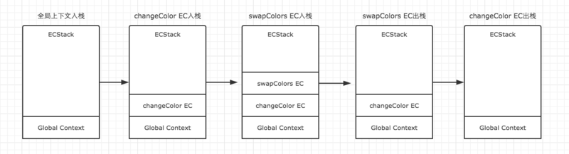

# 前端知识点整理

## JavaScript

### 执行上下文

1. 定义：当前 JavaScript 代码被解析和执行时所在环境的抽象概念， JavaScript 中运行任何的代码都是在执行上下文中运行。

2. 类型：

   - **全局执行上下文**： 这是默认的、最基础的执行上下文。不在任何函数中的代码都位于全局执行上下文中。它做了两件事：
     1. 创建一个全局对象，在浏览器中这个全局对象就是 window 对象。
     2. 将 this 指针指向这个全局对象。一个程序中只能存在一个全局执行上下文。
   - **函数执行上下文**： 每次调用函数时，都会为该函数创建一个新的执行上下文。每个函数都拥有自己的执行上下文，但是只有在函数被调用的时候才会被创建。一个程序中可以存在任意数量的函数执行上下文。

3. 生命周期

   执行上下文的生命周期包括三个阶段：**创建阶段 → 执行阶段 → 回收阶段**

   - 创建阶段

     当函数被调用，但未执行任何其内部代码之前，会做以下三件事：

     * 创建变量对象：首先初始化函数的参数 `arguments`，**提升函数声明**和**变量声明**。
     * 创建作用域链（Scope Chain）：在执行期上下文的创建阶段，作用域链是在变量对象之后创建的。作用域链本身包含变量对象。作用域链用于解析变量。当被要求解析变量时，JavaScript 始终从代码嵌套的最内层开始，如果最内层没有找到变量，就会跳转到上一层父作用域中查找，直到找到该变量。
     * 确定 this 指向：包括多种情况

   - 执行阶段：执行变量赋值、代码执行

    - 回收阶段：执行上下文出栈等待虚拟机回收执行上下文

4. 变量声明和函数声明提升

   ```javascript
   //变量声明提升
   console.log(a); // undefined
   var a = 10;
   
   //函数声明提升
   console.log(f1); // a
   function f1() {
     console.log('a');
   } // 函数声明
   console.log(f2); // undefined
   var f2 = function() {}; // 函数表达式
   ```

   **注意**：当遇到函数和变量同名且都会被提升的情况，**函数声明优先级比较高**，因此变量声明会被函数声明所覆盖，但是可以重新赋值。

   ```javascript
   console.log(a); //输出：function a(){ console.log('我是函数') }
   function a() {
       console.log("我是函数");
   } 
   var a = "我是变量";
   console.log(a); //输出：'我是变量'
   ```

   一个复杂的例子：

   ```javascript
   function test(arg) {
       // 1. 形参 arg 是 "hi"
       // 2. 因为函数声明比变量声明优先级高，所以此时 arg 是 function
       console.log(arg);
       var arg = "hello"; // 3.var arg 变量声明被忽略， arg = 'hello'被执行
       function arg() {
           console.log("hello world");
       }
       console.log(arg);
   }
   test("hi");
   /* 输出：
   function arg(){
       console.log('hello world') 
       }
   hello 
   */
   ```

5. `this`的指向

   - **this 的值是在执行的时候才能确认，定义的时候不能确认**

   

6. 执行上下文栈

   * JavaScript 执行在单线程上，所有的代码都是排队执行。

   * 一开始浏览器执行全局的代码时，首先创建全局的执行上下文，压入执行栈的顶部。

   * 每当进入一个函数的执行就会创建函数的执行上下文，并且把它压入执行栈的顶部。当前函数执行完成后，当前函数的执行上下文出栈，并等待垃圾回收。

   * 浏览器的 JS 执行引擎总是访问栈顶的执行上下文。

   * 全局上下文只有唯一的一个，它在浏览器关闭时出栈。

   * 例子：

     ```javascript
     var color = "blue";
     function changeColor() {
         var anotherColor = "red";
         function swapColors() {
             var tempColor = anotherColor;
             anotherColor = color;
             color = tempColor;
         }
         swapColors();
     }
     changeColor();
     ```

     

     

### 原型链


1. 每个函数都有一个 prototype 属性, 函数的 prototype 属性指向了一个对象，这个对象正是调用该构造函数而创建的**实例**的原型，也就是这个例子中的 person1 和 person2 的原型。
   * 什么是原型？每一个JavaScript对象(null除外)在创建的时候就会与之关联另一个对象，这个对象就是我们所说的原型，每一个对象都会从原型"继承"属性。
2. 当读取实例的属性时，如果找不到，就会查找与对象关联的原型中的属性，如果还查不到，就去找原型的原型，一直找到最顶层为止。
3. 当获取 person.constructor 时，其实 person 中并没有 constructor 属性,当不能读取到constructor 属性时，会从 person 的原型也就是 Person.prototype 中读取，正好原型中有该属性。

### `call()`&`apply()`

1. 作用：能够**改变函数执行时的上下文**，将一个对象的方法交给另一个对象来执行，并且是立即执行的。

2.  用法：

   - `Function.call(obj,[param1[,param2[,…[,paramN]]]])`

     - `call `的第一个参数，是一个对象。 `Function`中的`this`将会指向这个对象。如果不传，则默认为全局对象 `window`

     - 第二个参数开始，可以接收任意个参数。每个参数会映射到相应位置的 `Function` 的参数上。但是如果将所有的参数作为数组传入，它们会作为一个整体映射到 `Function `对应的第一个参数上，之后参数都为空。

       ```javascript
       function func (a,b,c) {}
       
       func.call(obj, 1,2,3)
       // func 接收到的参数实际上是 1,2,3
       
       func.call(obj, [1,2,3])
       // func 接收到的参数实际上是 [1,2,3],undefined,undefined
       ```

   - `Function.apply(obj[,argArray])`

     - 只接收两个参数，第一个参数的规则与 call 一致。

     - 第二个参数，必须是**数组或者类数组**，它们会被转换成类数组，传入` Function `中，并且会被映射到 `Function` 对应的参数上。这也是 call 和 apply 之间，很重要的一个区别。

       ```javascript
       func.apply(obj, [1,2,3])
       // func 接收到的参数实际上是 1,2,3
       
       func.apply(obj, {
           0: 1,
           1: 2,
           2: 3,
           length: 3
       })
       // func 接收到的参数实际上是 1,2,3
       ```

     - 类数组：

       ```javascript
       let arrayLike = {
           0: 1,
           1: 2,
           2: 3,
           length: 3
       };
       ```

       - 类数组 arrayLike 可以通过角标进行调用，具有length属性，同时也可以通过 for 循环进行遍历
       - **类数组无法使用 forEach、splice、push 等数组原型链上的方法**，毕竟它不是真正的数组

3. 用途

   - `call`

     - 对象的继承

       ```javascript
       function superClass () {
           this.a = 1;
           this.print = function () {
               console.log(this.a);
           }
       }
       
       function subClass () {
           superClass.call(this);
           this.print();
       }
       
       subClass();
       // 1
       ```

     - 借用方法（类数组使用数组原型链上的方法）

       ```javascript
       let domNodes = Array.prototype.slice.call(document.getElementsByTagName("*"));
       ```

       

   - `apply`

     - `Math.max()`

     - 数组合并

4. `bind()`

   - `bind()` 方法创建一个新的函数，在调用时设置 `this `关键字为提供的值。并在调用新函数时，将给定参数列表作为原函数的参数序列的前若干项。

     ```javascript
     function add (a, b) {
         return a + b;
     }
     
     function sub (a, b) {
         return a - b;
     }
     
     add.bind(sub, 5, 3); // 这时，并不会返回 8
     add.bind(sub, 5, 3)(); // 调用后，返回 8
     ```

5. 总结

   - call 和 apply 的主要作用，是改变对象的执行上下文，并且是**立即执行**的。它们在**参数**上的写法略有区别。
   - bind 也能改变对象的执行上下文，它与 call 和 apply 不同的是，**返回值是一个函数**，并且需要**稍后再调用**一下，才会执行。

### 继承

1. 原型链继承

   ```javascript
   function Parent () {
       this.name = 'kevin';
   }
   
   Parent.prototype.getName = function () {
       console.log(this.name);
   }
   
   function Child () {
   
   }
   
   Child.prototype = new Parent();
   
   var child1 = new Child();
   
   console.log(child1.getName()) // kevin
   ```

   问题：引用类型的属性被所有实例共享

2. 构造函数继承

   ```javascript
   function Parent () {
       this.names = ['kevin', 'daisy'];
   }
   
   function Child () {
       Parent.call(this);
   }
   
   var child1 = new Child();
   
   child1.names.push('yayu');
   
   console.log(child1.names); // ["kevin", "daisy", "yayu"]
   
   var child2 = new Child();
   
   console.log(child2.names); // ["kevin", "daisy"]
   ```

   问题：每次创建实例都会创建一遍方法

3. 组合继承（原型链 + 构造函数继承——**常用**）

   ```javascript
   function Parent (name) {
       this.name = name;
       this.colors = ['red', 'blue', 'green'];
   }
   
   Parent.prototype.getName = function () {
       console.log(this.name)
   }
   
   function Child (name, age) {
       Parent.call(this, name);   
       this.age = age;
   }
   
   Child.prototype = new Parent();//此时 Child.prototype 中的 constructor 被重写了，会导致 child1.constructor === Parent
   Child.prototype.constructor = Child;//将原型对象上的constructor指回自己
   
   var child1 = new Child('kevin', '18');
   
   child1.colors.push('black');
   
   console.log(child1.name); // kevin
   console.log(child1.age); // 18
   console.log(child1.colors); // ["red", "blue", "green", "black"]
   
   var child2 = new Child('daisy', '20');
   
   console.log(child2.name); // daisy
   console.log(child2.age); // 20
   console.log(child2.colors); // ["red", "blue", "green"]
   ```

   - 缺点：

     组合继承最大的缺点是会调用**两次**父构造函数

     一次是设置子类型实例的原型的时候：

     `Child.prototype = new Parent();`

     一次在创建子类型实例的时候：

     `var child1 = new Child('kevin', '18');`

     所以，在这个例子中，如果我们打印 child1 对象，我们会发现 Child.prototype 和 child1 都有一个属性为`colors`，属性值为`['red', 'blue', 'green']`。
     
   - 解决方案：

     使`Child.prototype`间接访问`Parent.prototype`

     ```javascript
     function Parent (name) {
         this.name = name;
         this.colors = ['red', 'blue', 'green'];
     }
     
     Parent.prototype.getName = function () {
         console.log(this.name)
     }
     
     function Child (name, age) {
         Parent.call(this, name);
         this.age = age;
     }
     
     // 关键的三步
     var F = function () {};
     F.prototype = Parent.prototype;
     Child.prototype = new F();
     
     Child.prototype.constructor = Child;
     var child1 = new Child('kevin', '18');
     console.log(child1);
     ```

4. 原型式继承

   ```javascript
   //ES5 Object.create 的模拟实现，将传入的对象作为创建的对象的原型
   function createObj(o) {
       function F(){}
       F.prototype = o;
       return new F();
   }
   
   var person = {
       name: 'kevin',
       friends: ['daisy', 'kelly']
   }
   
   var person1 = createObj(person);
   var person2 = createObj(person);
   
   person1.name = 'person1';
   console.log(person2.name); // kevin
   
   person1.firends.push('taylor');
   console.log(person2.friends); // ["daisy", "kelly", "taylor"]
   ```

   注意：修改`person1.name`的值，`person2.name`的值并未发生改变，并不是因为`person1`和`person2`有独立的 name 值，而是因为`person1.name = 'person1'`，给`person1`**添加了 name 值，并非修改了原型上的 name 值**。

5. 寄生式继承

   ```javascript
   function createObj (o) {
       var clone = Object.create(o);
       clone.sayName = function () {
           console.log('hi');
       }
       return clone;
   }
   ```

   缺点：跟借用构造函数模式一样，每次创建对象都会创建一遍方法

6. 寄生组合式继承（**见上方组合式继承缺点解决方案**）

### 作用域

1. **作用域链**：当查找变量的时候，会**先从当前上下文**的变量对象中查找，如果没有找到，就会从**父级**(词法层面上的父级)执行上下文的变量对象中查找，一直找到**全局上下文**的变量对象，也就是全局对象。这样由多个执行上下文的变量对象构成的链表就叫做作用域链。

2. **函数创建**：

   - 函数的作用域在函数定义的时候就决定了

   - `[[scope]]`:当函数创建的时候，就会保存所有父变量对象到其中，可以理解为`[[scope]]` 就是所有父变量对象的层级链，但是注意：`[[scope]] `并不代表完整的作用域链！

   - 举个例子：

     ```javascript
     function foo() {
         function bar() {
             ...
         }
     }
     ```

     函数创建时，各自的`[[scope]]`为：

     ```javascript
     foo.[[scope]] = [
       globalContext.VO
     ];
     
     bar.[[scope]] = [
         fooContext.AO,
         globalContext.VO
     ];
     ```

3. 函数激活

   当函数激活时，进入函数上下文，创建` VO/AO` 后，就会将**活动对象添加到作用域链的前端**。

   这时候执行上下文的作用域链，我们命名为` Scope`：

   ```javascript
   Scope = [AO].concat([[Scope]]);
   ```

   至此，作用域链创建完毕。

4. 执行流程：

   ```js
   var scope = "global scope";
   function checkscope(){
       var scope2 = 'local scope';
       return scope2;
   }
   checkscope();
   ```

   执行过程如下：

   1. checkscope 函数被创建，保存作用域链到内部属性[[scope]]

   ```js
   checkscope.[[scope]] = [
       globalContext.VO
   ];
   ```

   2. 执行 checkscope 函数，创建 checkscope 函数执行上下文，checkscope 函数执行上下文被压入执行上下文栈

   ```js
   ECStack = [
       checkscopeContext,
       globalContext
   ];
   ```

   3. checkscope 函数并不立刻执行，开始做准备工作，第一步：复制函数[[scope]]属性创建作用域链

   ```js
   checkscopeContext = {
       Scope: checkscope.[[scope]],
   }
   ```

   4. 第二步：用 arguments 创建活动对象，随后初始化活动对象，加入形参、函数声明、变量声明

   ```js
   checkscopeContext = {
       AO: {
           arguments: {
               length: 0
           },
           scope2: undefined
       }，
       Scope: checkscope.[[scope]],
   }
   ```

   5. 第三步：将活动对象压入 checkscope 作用域链顶端

   ```js
   checkscopeContext = {
       AO: {
           arguments: {
               length: 0
           },
           scope2: undefined
       },
       Scope: [AO, [[Scope]]]
   }
   ```

   6. 准备工作做完，开始执行函数，随着函数的执行，修改 AO 的属性值

   ```js
   checkscopeContext = {
       AO: {
           arguments: {
               length: 0
           },
           scope2: 'local scope'
       },
       Scope: [AO, [[Scope]]]
   }
   ```

   7. 查找到 scope2 的值，返回后函数执行完毕，函数上下文从执行上下文栈中弹出

   ```js
   ECStack = [
       globalContext
   ];
   ```

### 闭包

1. 理论上的闭包：闭包 = 函数 + 函数能够访问的自由变量(面试问的闭包应该不是这个...)

   ```javascript
   var a = 1;
   
   function foo() {
       console.log(a);
   }
   
   foo();
   ```

2. 实践中的闭包：

   - 即使创建它的上下文已经销毁，它仍然存在（比如，内部函数从父函数中返回）
   - 在代码中引用了自由变量

   - 闭包在嵌套函数**定义**的时候就产生了
   - 闭包在包含闭包的函数对象成为**垃圾对象**的时候死亡

3. 分析：

   ```javascript
   var scope = "global scope";
   function checkscope(){
       var scope = "local scope";
       function f(){
           return scope;
       }
       return f;
   }
   
   var foo = checkscope();
   foo();
   ```

   - 执行流程：
     - 进入全局代码，创建全局执行上下文，全局执行上下文压入执行上下文栈
     - 全局执行上下文初始化
     - 执行 checkscope 函数，创建 checkscope 函数执行上下文，checkscope 执行上下文被压入执行上下文栈
     - checkscope 执行上下文初始化，创建变量对象、作用域链、this等
     - checkscope 函数执行完毕，checkscope 执行上下文从执行上下文栈中弹出
     - 执行 f 函数，创建 f 函数执行上下文，f 执行上下文被压入执行上下文栈
     - f 执行上下文初始化，创建变量对象、作用域链、this等
     - f 函数执行完毕，f 函数上下文从执行上下文栈中弹出

4. 面试题

   1. ```javascript
      var data = [];
      
      for (var i = 0; i < 3; i++) {
        data[i] = function () {
          console.log(i);
        };
      }
      
      data[0]();
      data[1]();
      data[2]();
      ```

      - 全都是“3”，因为执行`data[0]()`函数时，全局的`i`已经是3了

      ```javascript
      var data = [];
      
      for (var i = 0; i < 3; i++) {
        data[i] = (function (i) {
              return function(){
                  console.log(i);
              }
        })(i);
      }
      
      data[0]();
      data[1]();
      data[2]();
      ```

      - 0, 1, 2——因为匿名函数的Context.AO(上下文活动对象)保存在`data[0]()`的作用域链上。

   2. ```javascript
      function fun(n,o) {
        console.log(o)
        return {
          fun:function(m){
            return fun(m,n);
          }
        };
      }
      var a = fun(0);  a.fun(1);  a.fun(2);  a.fun(3);//undefined,0,0,0
      var b = fun(0).fun(1).fun(2).fun(3);//undefined,0,1,2
      var c = fun(0).fun(1);  c.fun(2);  c.fun(3);//undefined,0,1,1
      ```

      - 根据代码可知闭包里面只有`n`；
      - 只要调用`fun()`，都会返回一个对象，对象中的`fun(m)`方法实际调用的是外部的`fun(n, o)`，其中`m`对应`n`，旧的`n`对应新的`o`；
      - 所以将返回的对象赋值后变量`n`就变成了传入的`m`；
      - 但是如果不在返回的新对象中调用`fun()`函数的话，变量`n`就不会改变，比如第9行的`a.fun()`，不管传入什么值，只会执行`fun(m, 0)`。

5. 缺点&解决方法

   - 缺点
     - 函数执行完成之后局部变量没有释放，导致内存被占用时间变长
     - 容易造成内存泄漏
   - 解决方法
     - 尽量避免使用闭包
     - 及时释放包含闭包的函数对象

### 变量提升&函数提升
1. 变量提升

     ```js
        console.log(a);  //undefined
         var a = 123;
     ```

     因为变量a的声明被提到了作用域顶端。上面代码编译后应该是下面这个样子

     ```js
         var a;
         console.log(a)
         a = 123
         //所以输出内容为 undeifend
     ```

2. 函数提升

   ```js
   //函数声明式
   bar()//输出1
   function bar () {
     console.log(1);
   }
   //变量形式声明； 
   foo()//报错：TypeError: foo is not a function
   var foo = function () {
     console.log(1);
   }
   ```

   - 函数变量形式声明和**普通变量提升**一样，只是一个没有值的变量，如果在之前使用会**报错**。

   - 函数声明式的提升现象和变量提升略有不同，函数声明式会提升到作用域最前边，并且将声明内容一起提升到最上边。

3. 总结：

   - 所有的声明都会提升到作用域的最顶上去。

   - 同一个变量只会声明一次，其他的会被忽略掉或者覆盖掉。

   - **函数声明的优先级高于变量声明的优先级**，并且函数声明和函数定义的部分一起被提升。

     ```js
     a()//输出function
     function a(){
         console.log('function')
     }
     var a = 1;
     ```

### `this`的指向

1. `this`的指向在函数定义的时候是确定不了的，只有函数执行的时候才能确定`this`到底指向谁**，**实际上`this`的最终指向的是那个调用它的对象。

2. 如果一个函数中有`this`，但是它没有被上一级的对象所调用，那么`this`指向的就是`window`，这里需要说明的是在js的严格模式下中`this`指向的不是`window`。

3. 如果一个函数中有`this`，这个函数有被上一级的对象所调用，那么`this`指向的就是上一级的对象。

4. 如果一个函数中有`this`，**这个函数中包含多个对象，尽管这个函数是被最外层的对象所调用，`this`指向的也只是它上一级的对象**。

   ```js
   var o = {
       a:10,
       b:{
           // a:12,
           fn:function(){
               console.log(this.a); //undefined
           }
       }
   }
   o.b.fn();
   ```

   ```js
   var o = {
       a:10,
       b:{
           a:12,
           fn:function(){
               console.log(this.a); //undefined
               console.log(this); //window
           }
       }
   }
   var j = o.b.fn;
   j();
   ```

5. `new`、`call`、`apply`、`bind`可以改变`this`的指向。

6. `this`和`return`

   - 如果返回值是一个对象，那么**this指向的就是那个返回的对象**，如果返回值不是一个对象那么this还是指向**函数的实例**。(`null`除外)

   ```js
   function fn()  
   {  
       this.user = 'user';  
       return {};  
   }
   var a = new fn;  
   console.log(a.user); //undefined
   ```

   ```js
   function fn()  
   {  
       this.user = 'user';  
       return undefined;
   }
   var a = new fn;  
   console.log(a.user); //user
   ```

   ```js
   function fn()  
   {  
       this.user = 'user';  
       return null;
   }
   var a = new fn;  
   console.log(a.user); //user
   ```

### 立即执行函数

1. 函数声明式和函数表达式

    - 函数声明式：`function f(){}`

    - 函数表达式：`var f = function(){}`

    - 区别：

      - 函数声明的函数名必须写，函数表达式不一定要写；

      - 函数声明式的整个函数会进行函数提升，而函数表达式只是定义的`f`变量提升；

      - 函数声明式不是一个完整的语句，不能出现在if-else, for循环等语句中；

      - 如果函数表达式声明的函数有函数名,那么这个函数名就相当于这个函数的一个**局部变量**,只能在函数内部调用,举个栗子:

        ```js
        var f = function fact(x) { 
        	if (x <= 1) 
        	     return 1;
        	 else 
        	     return x*fact(x-1);
        	 };
         alert(fact(10));   // Uncaught ReferenceError: fact is not defined
        ```

        

2. 写法（**括号前面不能是函数声明式**）

    - 错误写法1️⃣

      ```js
      function(){ /* code */}(); //SyntaxError: Unexpected token
      ```

    当圆括号为了调用函数而出现在函数后面时，无论在全局环境或者局部环境里遇到了这样的`function`关键字，默认的，它会将它当作是一个**函数声明**，而不是函数表达式，如果你不明确的告诉圆括号它是一个表达式，它会将其当作没有名字的函数声明并且抛出一个错误，因为函数声明需要一个名字。

    - 错误写法2️⃣

      ```js
      //函数声明语法上是无效的，它仍然是一个声明，圆括号里需要包含表达式
      function foo(){ /* code */ }();//SyntaxError: Unexpected token
      
      //现在把一个表达式放在圆括号里，没有抛出错误...,但是函数也并没有执行，因为：
      function foo(){/* code */}(1)
      
      //它等同于一个函数声明跟着一个完全没有关系的表达式:
      function foo(){/* code */}
      (1);
      ```

    - 正确写法

      ```js
      (function(){/* code */}());//括号内的表达式代表函数立即调用表达式
      (function(){/* code */})();//括号内的表达式代表函数表达式
      ```

      将函数声明包裹在圆括号里来告诉语法分析器去表达一个函数表达式，因为在Javascript里，圆括号不能包含声明。因为这点，当圆括号为了包裹函数碰上了 `function`关键词，它便知道将它作为一个函数表达式去解析而不是函数声明。注意理解这里的圆括号和上面的圆括号遇到函数时的表现是不一样的，也就是说。

      * 当圆括号**出现在匿名函数的末尾**想要调用函数时，它会默认将函数当成是函数声明。
      * 当圆括号**包裹函数**时，它会默认将函数作为表达式去解析，而不是函数声明。

3. 保存闭包状态（见闭包面试题第2️⃣题）

    - 当函数通过他们的名字被调用时，参数会被传递；而当函数表达式被立即调用时，参数也会被传递。一个立即调用的函数表达式可以用来锁定值并且有效的保存此时的状态，因为任何定义在一个函数内的函数都可以使用外面函数传递进来的参数和变量(这种关系被叫做闭包)。

### `instanceof`&`typeof`

1. `typeof` 一般被用于判断一个变量的类型，我们可以利用 `typeof` 来判断`number`, `string`, `object`, `boolean`, `function`, `undefined`, `symbol` 这七种类型。

2. `typeof`原理：

   - js 在底层存储变量的时候，会在变量的机器码的低位1-3位存储其类型信息
     - 000：对象
     - 010：浮点数
     - 100：字符串
     - 110：布尔
     - 1：整数
   - null储存方式是所有机器码全为0
   - undefined的储存方式是-2<sup>30</sup>整数表示
   - 所以，`typeof` 在判断 `null` 的时候就出现问题了，由于 `null` 的所有机器码均为0，因此直接被当做了对象来看待。

3. `instanceof`原理

   - `instanceof` 主要的作用就是判断一个实例是否属于某种类型或者判断一个实例是否是其父类型或者祖先类型的实例。

     ```js
     //第一种
     let person = function () {
     }
     let nicole = new person()
     nicole instanceof person // true
     
     //第二种
     let person = function () {
     }
     let programmer = function () {
     }
     programmer.prototype = new person()
     let nicole = new programmer()
     nicole instanceof person // true
     nicole instanceof programmer // true
     ```

   - 代码实现

     ```js
     function new_instance_of(leftVaule, rightVaule) 
     { 
       if (typeof leftValue !== 'object' || leftValue === null) return false;
       let rightProto = rightVaule.prototype; // 取右表达式的 prototype 值
       leftVaule = leftVaule.__proto__; // 取左表达式的__proto__值 
       while (true) 
       { 
         if (leftVaule === null) return false;
         if(leftVaule === rightProto) return true; 
         leftVaule = leftVaule.__proto__ 
       } 
     }
     ```

### `bind()`实现


