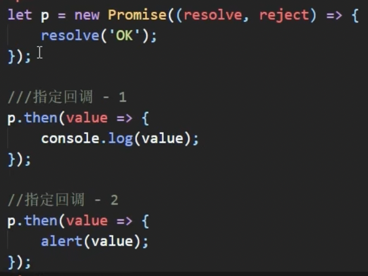

# Promise笔记

## 理解和使用

### 理解

1. 异步编程（旧版本是使用的是回调函数）：

   * fs 文件操作
     * `require('fs').readFile('./index.html', (err, data) => {})`
   * 数据库操作
   * AJAX操作
     * `$.get('/server', data => {})`
   * 定时器
     * `setTimeout(() => {}, 2000)//2s`

2. 使用`Promise`的原因：

   1. 支持链式调用，解决回调地狱问题
      * 回调地狱：一个回调函数中嵌套另外一个异步任务，以此类推（不便阅读，不便异常处理）
   2. 指定回调函数的方式更灵活
      * 旧版本必须在启动异步任务前指定回调函数
      * `Promise`启动异步任务之后再给`promise`对象绑定回调函数（可以多个）

3. `Promise`的基本使用：

   * `promise`封装定时器

     ```javascript
     //Promise实现
     //resolve 成功时调用的函数
     //reject 失败时调用的函数
     const p = new Promise((resolve, reject) => {
         setTimeout(() => {
             let n = rand(1, 100)
             if (n <= 30) resolve(n) //将promise对象的状态设置成'成功',并且可以将成功值传入函数
             else reject(n) //失败也可以将失败值传入函数供使用
         }, 1000)
     })
     //then方法 第一个回调函数是resolve回调函数，第二个回调函数是reject回调函数
     p.then(value => {
         alert('Congratulations! Your number is ' + value)
     },reason =>{
         alert('Sorry! Your number is ' + reason)
     })
     ```

   * `promise`封装文件读取操作

     ```javascript
     /*
         封装一个读取文件内容的函数
         参数：path 文件路径
         返回：promise对象
      */
     const fs = require('fs')
     function myReadFile(path){
         return new Promise((resolve, reject) => {
             fs.readFile(path, ((err, data) => {
                 if (err) reject(err)
                 else resolve(data)
             }))
         })
     }
     
     myReadFile('resource/test.txt').then(value => console.log(value.toString()), reason => console.log(reason))
     ```

   * `promise`封装AJAX请求

     ```javascript
     const p = new Promise((resolve, reject) => {
         //发送ajax请求
         const xhr = new XMLHttpRequest()
         xhr.open('GET', 'https://api.apiopen.top/getJoke')
         xhr.send()
         xhr.onreadystatechange = function (){
             if (xhr.readyState === 4){
                 if (xhr.status >= 200 && xhr.status < 300) resolve(xhr.response)
                 else reject(xhr.status)
             }
         }
     }).then(value => console.log(value), reason => console.log(reason))
     ```

4. `util.promisify`：

   * 传入一个遵循常见的**错误优先**的回调风格的函数`以(err, value) => ...回调作为最后一个参数`, 并且返回一个`promise`对象

     ```javascript
     // util.promisify 方法
     const util = require('util')
     const fs = require('fs')
     //返回一个promise对象，相当于上方的myReadFile.js中实现的函数
     let myReadFile = util.promisify(fs.readFile)
     myReadFile('resource/test.txt').then(value => console.log(value.toString()), reason => console.log(reason))
     ```

### `promise`的状态改变

   1. 状态是`promise`实例对象中的一个属性（`PromiseState`）
      * 三个取值：
        * `pending`										**未决定**
        * `resolved / fulfilled`         **成功**
        * `rejected`                                **失败**
      * 两种改变方式：
        * `pending`变为`resolved`
        * `pending`变为`rejected`
      * 说明
        * 只有两种改变方式，且一个promise对象的状态只能改变一次
        * 无论成功还是失败，都只会有一个结果数据
        * 成功一般称为`value`，失败一般称为`reason`

   ### `promise`对象的值

   1. 实例对象中的另一个属性（`PromiseResult`）
      * 保存着对象**成功/失败**的结果
      * 只有`resolve`和`reject`函数才能改变该属性
      * 在后续的`then`方法中可以将该值取出来进行相关操作

   ### `promise`的工作流程

   

   ### 如何使用`Promise`

   #### API

   1. `Promise`构造函数函数`Promise(executor){}`
      * `executor`:执行器`(resolve, reject) => {}`
      * `resolve`:内部定义成功时调用的函数 `value => {}`
      * `reject`:内部定义失败时调用的函数 `reason => {}`
      * `executor`在`Promise`内部是**同步调用**的，异步操作是在`executor`中执行的
   2. `Promise.prototype.then`方法：`(onResolved, onRejected) => {}`
      * `onResolved`:成功的回调函数 `value => {}`      **异步执行**
      * `onRejected`:失败的回调函数 `reason => {}`    **异步执行**
      * 上述两个回调函数都会返回一个新的`promise`对象
   3. `Promise.prototype.catch`方法：`onRejected => {}`
      * 该方法只能指定失败的回调函数 `reason => {}`
   4. `Promise.resolve方法：value => {}`：
      * 返回一个**成功/失败**的promise对象
   5. `Promise.reject方法：reason => {}`：
      * 返回一个**失败**的promise对象
   6. `Promise.all方法：promises => {}`：
      * `promises`是包含n个promise对象的数组，返回一个新的promise对象(**每个promise对象成功结果的数组**)，只有传入的所有promise对象全成功，返回的promise对象才是成功的，否则直接失败(**失败的那个promise对象失败的结果**)
   7. `Promise.race方法：promises => {}`:
      * 和all方法类似，结果是第一个成功的promise对象的成功结果

#### 几个关键问题

   1. 如何改变`promise`状态？
      * 调用`resolve()`函数—— **pending => fulfilled(resolved)**
      * 调用`reject()`函数—— **pending => rejected**
      * 抛出错误（`throw`）
   2. 一个`promise`指定多个成功/失败回调函数时，都会调用吗？
      * 当`promise`对象状态改变之后都会调用
   3. 改变`promise`状态和指定回调函数谁先谁后（即上图的`resolve()和then()`谁先执行）？
      * 都有可能
        * **Promise执行器中的任务是同步任务**的情况下是**先改变状态，再指定回调**
        * **Promise执行器中的任务是异步任务**的情况下是**先指定回调，再改变状态**
      * 如何先改状态，再回调
        * 直接调用`resolve()/reject()`
        * 延时调用`then()`
      * 何时得到数据
        * 先改变状态，指定回调时，回调函数调用，得到数据；
        * 先指定回调，状态发生改变时，回调函数调用，得到数据；
        * 总结：**回调函数调用之后得到数据**
   4. `promise.then()`返回的新`promise`的结果状态由什么决定？
      * 简单表述；由`then`的指定的回调函数执行的结果决定
      * 详细表述：
        * 如果抛出异常，`PromiseState = rejected, reason = 异常`
        * 如果非`promise`, `PromiseState = resolved, value = 返回值`
        * 如果返回新的`promise`, 则此`promise`结果就是新`promise`的结果
   5. `promise`如何串连多个操作任务？
      * `promise`的`then()`中返回一个新的`promise`
      * 通过`then()`的链式调用串连多个同步/异步任务
   6. `promise`的异常穿透？
      * 使用`then()`链式调用时，可以在最后指定失败的回调
      * 前面的所有的异常都会传到最后的失败回调中
   7. 中断`promise`链？
      * 在回调函数中返回一个`pending`状态的`promise`对象

## 自定义`Promise`

### 代码实现

```javascript
class Promise{
    
    constructor(executor) {
        //添加属性
        this.PromiseState = 'pending'
        this.PromiseResult = null
        //声明异步任务时回调函数
        this.callbacks = []
        //编写resolve和reject函数，并且控制状态和结果只能改变一次
        let resolve = value => {
            if (this.PromiseState !== 'pending') return
            //修改状态 PromiseState
            this.PromiseState = 'resolved'
            //修改结果值 PromiseResult
            this.PromiseResult = value
            //使用定时器是为了让then()里的任务异步执行
            setTimeout(() =>{
               //如果executor里的是异步任务，则先通过then()拿到callbacks里中保存的函数，再执行
                this.callbacks.forEach(item =>{
                    if (item.onResolved) item.onResolved(this.PromiseResult)
                })
            })
        }
        let reject = reason => {
            if (this.PromiseState !== 'pending') return
            this.PromiseState = 'rejected'
            this.PromiseResult = reason
            setTimeout(() => {
                this.callbacks.forEach(item =>{
                    if (item.onRejected) item.onRejected(this.PromiseResult)
                })
            })
        }
        //处理抛出错误
        try{
            //同步调用executor
            executor(resolve, reject)
        }catch (e){
            //调用失败函数
            reject(e)
        }
    }

    then = (onResolved, onRejected) => {
        //异常穿透
        if (typeof onRejected !== 'function') {
            onRejected = reason => {
                throw reason
            }
        }
        //值传递
        if (typeof onResolved !== 'function') onResolved = value => value

        return new Promise((resolve, reject) => {
            //封装回调函数
            let callback = type => {
                //try-catch接收抛出的错误
                try {
                    let result = type(this.PromiseResult)
                    if (result instanceof Promise) {
                        //如果结果是一个Promise对象
                        result.then(value => resolve(value), reason => reject(reason))
                    } else {
                        //如果结果不是一个Promise对象，则结果状态为成功
                        resolve(result)
                    }
                } catch (e) {
                    reject(e)
                }
            }
            if (this.PromiseState === 'resolved') {
                //使用定时器是为了让then()里的任务异步执行
                setTimeout(() => callback(onResolved))
            }
            else if (this.PromiseState === 'rejected') {
                setTimeout(() => callback(onRejected))
            }
            else {
                //保存回调函数
                this.callbacks.push({onResolved: () => callback(onResolved), onRejected: () => callback(onRejected)})
            }
        })
    }

    catch = onRejected =>{
        return this.then(undefined, onRejected)
    }

    static resolve(value){
        return new Promise((resolve, reject) => {
            if (value instanceof Promise){
                value.then(value => resolve(value), reason => reject(reason))
            }else{
                resolve(value)
            }
        })
    }

    static reject(reason){
        return new Promise((resolve, reject) => {
            reject(reason)
        })
    }

    static all(promises){
        return new Promise((resolve, reject) => {
            let allSuccess = true
            let successResults = []
            promises.forEach((item, index) =>{
                item.then(value => {
                    successResults[index] = value
                    if (index === promises.length - 1 && allSuccess){
                        resolve(successResults)
                    }
                }, reason => {
                    allSuccess = false
                    reject(reason)
                })
            })
        })
    }

    static race(promises){
        return new Promise((resolve, reject) => {
            for (let i = 0; i < promises.length; i++){
                promises[i].then(value => resolve(value),reason => reject(reason))
            }
        })
    }
}
```

## `async` & `await`

### `async`

1. 函数返回值是一个`Promise`对象

   

2. `Promise`对象的结果有`async`函数执行的返回值决定

   

### `await`

1. `await`右侧的表达式一般为`promise`对象，也可以是其他值
   * 如果是`promise`对象，`await`返回的是`promise`成功的值
   * 如果是其他值，则此值就是`await`的返回值
2. `await`必须写在`asnyc`函数中，但是`async`函数中可以没有`await`
3. 如果`await`的`promise`失败了，需要通过try - catch捕获异常并进行处理

### 结合使用

1. 读取文件

   ```javascript
   /*
       读取resource文件夹下的1.html, 2.html, 3.html 文件内容并进行拼接
    */
   
   const fs = require('fs')
   const util = require('util')
   const myReadFile = util.promisify(fs.readFile)
   
   // //回调函数实现方式
   // fs.readFile('./resource/1.html', (err, data1) => {
   //     if (err) throw err
   //     fs.readFile('./resource/2.html', (err, data2) =>{
   //         if (err) throw err
   //         fs.readFile('./resource/3.html', (err, data3) =>{
   //             if (err) throw err
   //             console.log(data1 + data2 + data3)
   //         })
   //     })
   // })
   
   main = async() =>{
       let data1 = await myReadFile('./resource/1.html')
       let data2 = await myReadFile('./resource/2.html')
       let data3 = await myReadFile('./resource/3.html')
       console.log(data1 + data2 +data3)
   }
   main()
   ```